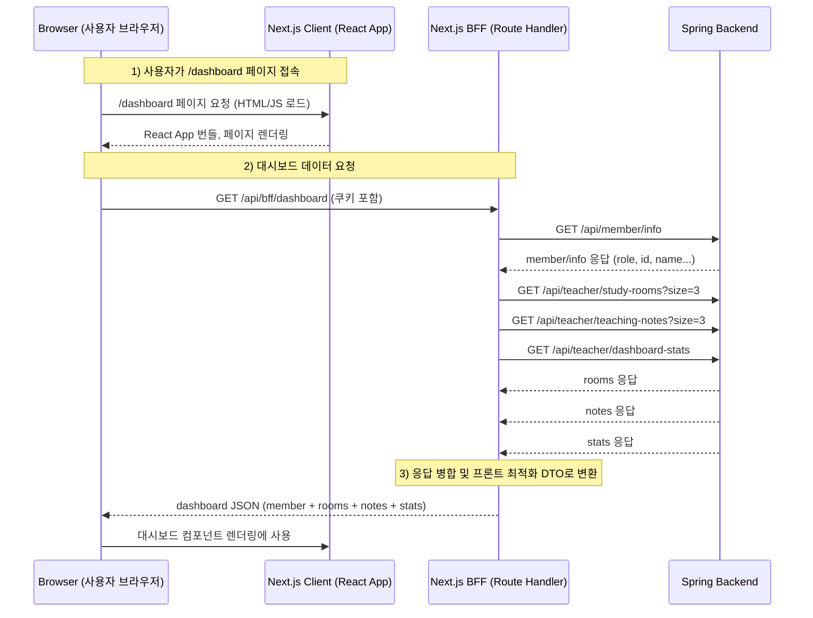

# BFF (Backend For Frontend) 개념 정리 – Next.js + Spring 기반

### 1. 전체 시퀀스 다이어그램


요청 흐름 단계별 설명

브라우저가 /dashboard URL로 접속

Next.js가 SSR/CSR 방식으로 React App을 브라우저에 내려보냄.

이 시점에는 UI 골격만 있고, 실제 데이터(스터디룸, 노트, 통계)는 아직 없음.

React App에서 useQuery 또는 fetch로 /api/bff/dashboard 호출

이 엔드포인트는 클라 전용이 아니라 서버 전용 레이어(BFF).

브라우저는 단 1번만 요청을 보냄.

Next.js BFF(Route Handler) 내부에서 Spring으로 여러 번 요청

GET /api/member/info 로 실제 로그인 유저의 role, id를 확인

role이 teacher인 경우:

GET /api/teacher/study-rooms?size=3

GET /api/teacher/teaching-notes?size=3

GET /api/teacher/dashboard-stats

이 호출들은 서버-서버 통신이므로 병렬 처리도 쉽고, 브라우저보다 네트워크가 안정적임.

BFF에서 받은 3개 응답을 프론트용 DTO로 조립
```js
{
  member: { id, name, role },
  rooms: [...3개],
    notes: [...3개],
    stats: { totalStudents, totalNotes, ... }
}
```
브라우저는 이 하나의 JSON을 받아서 대시보드 컴포넌트를 렌더링

상단 프로필 영역: member

스터디룸 카드 3개: rooms

최근 노트 3개: notes

통계 박스: stats

## 1. BFF가 필요한 이유
프론트엔드가 여러 API를 직접 호출하면 다음 문제가 생긴다:

- 브라우저 → 서버 API 요청이 **여러 번 발생**해 성능 저하
- 각 API마다 로딩/에러 상태를 따로 관리해야 해서 UI/상태관리 복잡
- 백엔드 API 스펙 변경 시 프론트가 직접 깨질 위험 증가
- 클라이언트는 믿을 수 없는 환경 → 권한(Role) 체크를 클라에서 하면 **보안 취약**
- 대시보드처럼 “한 곳에서 여러 데이터가 동시에 필요한” 경우 불편

➡ **BFF는 이런 문제를 해결하기 위해, 프론트 요청을 한 곳에서 조립해서 제공하는 서버 계층**

클라이언트가 직접 스프링 API를 3번 호출하면:

- 브라우저 ↔ 서버 사이에서 **3번 왕복**
- 네트워크 지연(Latency) 증가
- 호출마다 별도 로딩/에러 관리
- 백엔드 API 변경에 프론트가 바로 깨짐
- Role/권한 체크를 브라우저에서 하면 **보안 취약**

BFF는 이 문제를 해결하기 위해 등장했다.

**브라우저는 단 1번 요청만 보내고, BFF가 내부적으로 백엔드 API 여러 개를 묶어서 반환한다.**

---

## 2. BFF가 하는 역할

### (1) 여러 백엔드 API를 하나로 합친다
예: 대시보드 위젯 3개 표시하려면 원래 3번 API 호출해야 함 → BFF는 내부에서 병렬 호출 후 하나로 묶어 return.

- Room 최신 3개
- Teaching notes 최신 3개
- 전체 학생 수
- Member info(권한)

➡ 클라는 `/api/bff/dashboard` **1번 호출만 하면 됨**

---

### (2) 권한 / 역할(Role) 체크를 안전한 서버에서 처리
클라이언트에서 role 값을 보내면 조작 가능하므로 신뢰할 수 없음.
BFF는 쿠키 기반 세션을 직접 읽고 백엔드에 `member/info` 호출 후 role을 확인함.

**즉, "teacher만 접근 가능" 같은 규칙을 안전하게 지킬 수 있음.**

---

### (3) 응답 포맷을 프론트 친화적으로 재구성
백엔드 스펙에 따라 응답 구조가 제각각이더라도  
BFF에서 하나의 통일된 구조로 변환하여 프론트에 내려줌.

➡ **프론트는 변경에 훨씬 강해짐**

---

### (4) 브라우저 네트워크 비용 절감
브라우저 ↔ BFF(Vercel) 왕복은 최소화  
BFF ↔ Backend(AWS) 통신은 서버 간 통신이라 빠름.

➡ 모바일/저속 환경에서 UX 차이가 크게 남.

---

## 3. 성능/비용 분석 (중요)

### 🥇 3-1. 성능: BFF가 압도적으로 유리

#### ✔ 브라우저 ↔ Vercel
- 직접 호출: **3회 왕복**
- BFF: **1회 왕복**

브라우저 네트워크는 가장 느리고, 모바일/와이파이 환경에서는 차이가 더 커짐.

#### ✔ Vercel ↔ AWS
서버 간 통신은 빠르고 병렬로 처리할 수 있음 → 오히려 더 빠름.

#### ✔ 데이터 전송량
3번 헤더 전송 → 1번만 전송  
➡ 대역폭 낭비를 크게 줄임.

---

### 💰 3-2. 비용: BFF가 더 효율적

#### ✔ Vercel 비용 구조
- API 호출 3번 = Vercel Function 3번 실행
- BFF 1번 = Function 1번 실행

콜드스타트 발생도 3 → 1 로 줄어듦.

#### ✔ AWS 비용
서버-서버는 일반적으로 저렴 → 큰 차이 없음.

#### ✔ 대역폭(Bandwidth) 비용
클라이언트 ↔ 서버의 전송량이 줄기 때문에 비용 절감 가능.

---

## 4. BFF 기본 구현 예시

### 📌 Next.js (Vercel) BFF 라우트

```ts
// /app/api/bff/dashboard/route.ts
import { DashboardSchema } from "./dashboard.schema";
import { authBffHttp } from "@/shared/api";

export async function GET() {
  // 1. 멤버 정보로 Role 확인
  const memberRes = await authBffHttp.get("/api/member/info");
  const member = memberRes.data.data;

  // 2. 백엔드 API 병렬 호출
  const [rooms, notes, stats] = await Promise.all([
    authBffHttp.get("/api/teacher/study-rooms?size=3"),
    authBffHttp.get("/api/teacher/teaching-notes?size=3"),
    authBffHttp.get("/api/teacher/dashboard-stats"),
  ]);

  // 3. 프론트 친화적 형식으로 변환
  const dashboard = DashboardSchema.parse({
    member,
    rooms: rooms.data.data,
    notes: notes.data.data,
    stats: stats.data.data,
  });

  return Response.json(dashboard);
}
```

## NextRouter -> NextRouter(member) -> Spring 이건 너무 비효율 ?
네, 맞습니다. 요청 흐름이 NextRouter $\rightarrow$ NextRouter(member) $\rightarrow$ Spring으로 이어지는 것은 일반적으로 비효율적입니다. ❌

📉 비효율적인 이유 (이중 프록시)

현재의 구조는 요청을 두 번이나 Next.js 서버 내부에서 **프록시(Proxy)**하게 만드는 형태입니다.

클라이언트 (Client) $\rightarrow$ Next.js Router A (예: /api/some-feature)

Next.js Router A $\rightarrow$ Next.js Router B (예: /api/v1/member/info)

Next.js Router B $\rightarrow$ Spring BFF

1. 중복된 네트워크 오버헤드

Next.js 서버 내부에서 요청이 발생하더라도, 실제로는 Node.js 이벤트 루프와 네트워크 스택을 두 번 거치게 됩니다. 이는 불필요한 **지연 시간(latency)**과 처리 부하를 유발합니다.

2. 불필요한 로직 분리

member 정보를 가져오는 로직은 본질적으로 Spring BFF로 요청을 보내는 단일 목적을 가지고 있습니다. 이를 별도의 Next.js 라우터(Router B)로 분리하는 것은 코드의 흐름을 복잡하게 만들고, Router A에서 Router B로 요청을 전달할 때 헤더나 쿠키를 또다시 수동으로 전달해야 하는 번거로움을 초래합니다.

3. 인증 및 에러 처리 복잡성

인증 쿠키 처리나 에러 핸들링 로직이 Router A와 Router B에 분산되어 있다면, 일관성을 유지하기가 어렵고 디버깅도 힘들어집니다.

✅ 권장되는 효율적인 흐름

가장 효율적이고 표준적인 BFF 패턴은 Next.js 라우터 핸들러에서 바로 Spring BFF로 요청하는 것입니다.

💡 Single Next.js Router (권장)

member 정보를 조회하는 로직이 필요하다면, Router A의 내부 함수로 만들거나, 또는 현재 구조처럼 repository 함수로 만들어서 Router A에서 직접 호출해야 합니다.

| 단계   | 주체                | 대상                 | 비고                                      |
|--------|----------------------|-----------------------|--------------------------------------------|
| 1단계 | 클라이언트 (Client) | Next.js Router (BFF) | 인증 쿠키를 Next.js Router로 전달          |
| 2단계 | Next.js Router (BFF) | Spring BFF           | serverToBffApi를 사용하여 Spring으로 요청 |


예시:
```js
// pages/api/some-feature.ts (Next.js Router A)

import { NextRequest } from 'next/server';
import { repository } from '@/entities/member'; // Spring으로 바로 쏘는 repository

export async function GET(request: NextRequest) {
  // 1. Router A에서 repository 함수를 직접 호출
  const member = await repository.member.getMember(request); 
  
  // ... 나머지 로직 처리
}
```
이 방식은 불필요한 요청 단계를 제거하여 성능을 최적화하고 코드의 응집성을 높여줍니다.