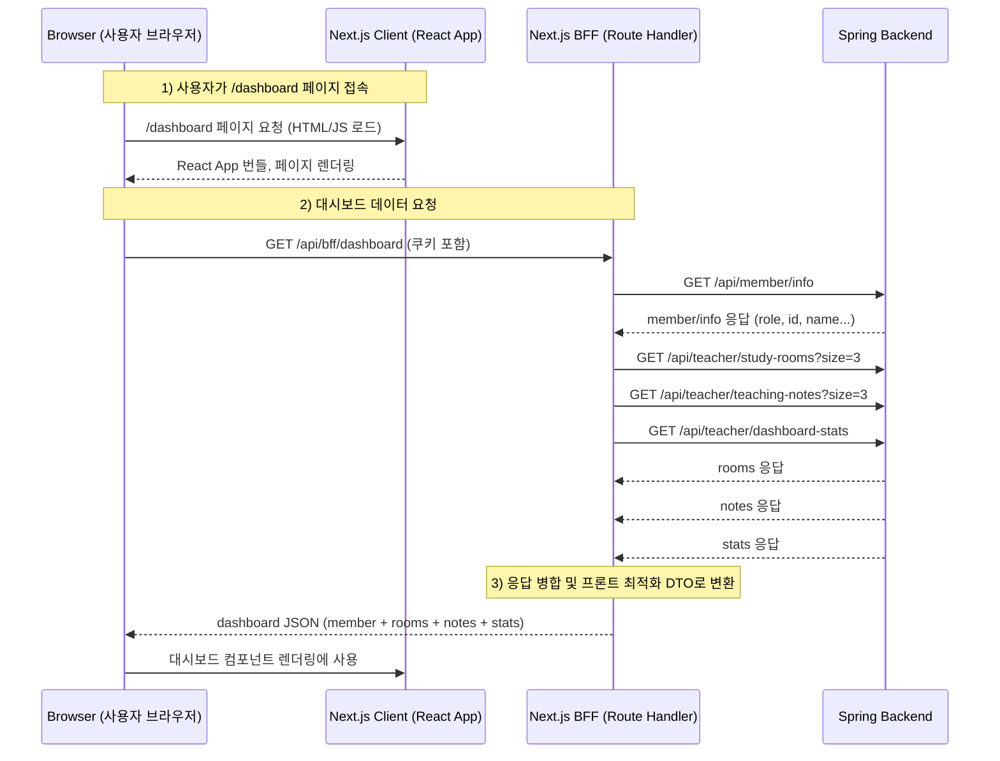

## BFF(Backend For Frontend)개념 정리 – Next.js + Spring 기반
디에듀(D-edu) 프로젝트를 진행하면서, 클라이언트에서의 데이터 요청 횟수를 최소화하고 대시보드 화면의 데이터 의존성을 단순하게 만드는 방법을 고민하다가 BFF 패턴을 알게 되었다.

특히 하나의 화면을 구성하기 위해 여러 개의 백엔드 API를 호출해야 하고, 그 데이터를 프론트에서 다시 가공해야 하는 상황이 반복되면서 **클라이언트가 이런 로직을 다 처리하는 것이 맞는가?**라는 의문이 생겼다. 이 문제를 해결하기 위해 프론트 전용 레이어인 BFF(Backend For Frontend) 를 도입하게 되었고, 아래는 그 과정에서 정리한 개념과 구현 내용이다.

## BFF란(Backend For Frontend) ?
BFF는 프론트엔드 전용 백엔드 계층이다. 특정 프론트엔드 화면이나 플랫폼(웹, 모바일, 관리자 등)에 최적화된 API를 제공하는 서버를 의미한다.

전통적으로 Spring과 같은 백엔드는 여러 서비스 간 공통 로직을 처리하는 **도메인 중심 서버**로 구성되어 있지만, BFF는 **오직 프론트에서 필요한 형태로 데이터를 조립하고 가공**하는 역할에 집중한다. Next.js의 Route Handler는 서버 환경에서 실행되기 때문에, 웹 프론트엔드 기준으로는 BFF 구현 위치로 가장 자연스럽다.

요약하면, BFF는 다음과 같은 일을 한다.  
- 백엔드가 제공하는 여러 API를 하나로 합쳐서 제공
- 프론트 렌더링에 편한 형태로 DTO를 재구성
- 인증/권한을 서버에서 안전하게 처리
- 프론트와 백엔드 사이의 변화 충격을 완화하는 완충 계층
- 네트워크 비용 감소(브라우저 → BFF 한 번만 요청하면 됨)

## 더 일반적인 관점에서 본 BFF의 필요성
BFF는 특정 프로젝트뿐 아니라 다음과 같은 상황에서 자연스럽게 필요성이 드러난다.

### 마이크로서비스 아키텍처(MSA)에서 서비스가 여러 개로 분리된 경우
여러 도메인(회원, 권한, 콘텐츠, 통계 등)이 각각 별도 서비스로 운영되면 프론트는 필요한 데이터를 얻기 위해 여러 서비스로 동시에 요청해야 한다.(여러 서비스의 데이터를 합쳐야함) 이 경우 프론트가 직접 API를 여러 번 호출하면 요청, 응답 구조가 복잡해지고 네트워크 비용이 기하급수적으로 늘어난다.

### 플랫폼별로 필요한 데이터 구조가 서로 다른 경우
웹, 모바일, 태블릿, 관리자 콘솔은 서로 필요한 필드와 데이터 양이 다르다. 모바일은 최소 데이터만 필요할 수 있고, 관리자 콘솔은 더 많은 필드를 필요로 한다. 프론트가 각자 데이터를 가공하기 시작하면 유지보수가 어려워지고, 백엔드가 모든 플랫폼을 고려해 API를 만들기 시작하면, API 스펙이 커지고 유지보수가 어려워진다. 이때 BFF는 각 플랫폼에 맞는 API를 만들어 충격을 흡수한다.

### 클라이언트에서 처리하기엔 무거운 연산을 서버에서 수행하고 싶은 경우
여러 데이터를 합산하거나 필터링하거나 통계를 만들어야 할 때, 프론트에서 처리하면 CPU를 많이 쓰고 네트워크 비용까지 증가한다.(대량 데이터 집계, 통계, 정렬, 필터링 등은 모바일/브라우저 환경에서 처리하기엔 무겁다.)

이런 계산을 프론트에서 하면 성능이 떨어지고 UX가 저하되기 때문에, BFF가 중간에서 데이터를 미리 정리해 전달하면 클라이언트는 가볍게 렌더링에 집중할 수 있다.

## 전체 시퀀스 다이어그램 (디에듀 대시보드 예시)

#### 요청 흐름 단계별 설명
##### 브라우저가 /dashboard URL로 접속 
브라우저는 Next.js 서버에 페이지를 요청하고, React App이 렌더링된다.
이때는 UI 껍데기만 내려오고, 실제 데이터(스터디룸, 노트, 통계)는 없다.

##### 클라이언트가 /api/bff/dashboard 호출
대시보드에 필요한 모든 데이터는 여기로 요청된다. 프론트에서는 요청 도구(fetch, axios, react-query, swr...)와 상관없이 동일한 흐름을 가진다. 어떤 도구를 쓰든, 클라이언트는 브라우저 → BFF 단 한 번만 요청을 보내게 된다.
```ts
const { data } = useQuery({
  queryKey: ["dashboard"],
  queryFn: () => fetch("/api/bff/dashboard").then((r) => r.json()),
});
```
이 요청을 Next.js 서버(Route Handler)가 받고, BFF 내부에서 Spring API 여러 개를 병렬로 호출해 데이터를 조립한 후,
프론트에서 쓰기 쉬운 형태로 최종 JSON을 반환한다.

##### BFF(Route Handler)가 Spring 서버에 여러 번 요청
이 요청들은 서버 → 서버 통신이므로 빠르고 안정적이며, 병렬로 호출하기도 쉽다.
- /api/member/info
- /api/teacher/study-rooms?size=3
- /api/teacher/teaching-notes?size=3
- /api/teacher/dashboard-stats

##### BFF가 데이터를 하나의 DTO로 조립하여 응답
브라우저는 이 한 번의 응답(JSON)으로 대시보드 모든 정보를 렌더링한다.
- 상단 프로필 영역: member 
- 스터디룸 카드 3개: rooms
- 최근 노트 3개: notes
- 통계 박스: stats
```js
{
  member: { id, name, role },
  rooms: [...3개], 
    notes: [...3개],
    stats: { totalStudents, totalNotes, ... }
}
```

## BFF가 필요한 이유
프론트엔드가 여러 API를 직접 호출하면 다음 문제가 생긴다

- 브라우저 → 서버 API 요청이 **여러 번 발생**해 성능 저하
- 각 API마다 로딩/에러 상태를 따로 관리해야 해서 UI/상태관리 복잡
- 백엔드 API 스펙 변경 시 프론트가 직접 깨질 위험 증가
- 클라이언트는 믿을 수 없는 환경 → 권한(Role) 체크를 클라에서 하면 **보안 취약**
- 대시보드처럼 “한 곳에서 여러 데이터가 동시에 필요한” 경우 불편

➡ **BFF는 이런 문제를 해결하기 위해, 프론트 요청을 한 곳에서 조립해서 제공하는 서버 계층**

클라이언트가 직접 스프링 API를 3번 호출하면

- 브라우저 ↔ 서버 사이에서 **3번 왕복**
- 네트워크 지연(Latency) 증가
- 호출마다 별도 로딩/에러 관리
- 백엔드 API 변경에 프론트가 바로 깨짐
- Role/권한 체크를 브라우저에서 하면 **보안 취약**

BFF는 이 문제를 해결하기 위해 등장했다.

**브라우저는 단 1번 요청만 보내고, BFF가 내부적으로 백엔드 API 여러 개를 묶어서 반환한다.**

---

## BFF가 하는 역할
### 여러 백엔드 API를 하나로 합친다
예: 대시보드 위젯 3개 표시하려면 원래 3번 API 호출해야 함 → BFF는 내부에서 병렬 호출 후 하나로 묶어 return.

- Room 최신 3개
- Teaching notes 최신 3개
- 전체 학생 수
- Member info(권한)

➡ 클라는 `/api/bff/dashboard` **1번 호출만 하면 됨**

### 권한 / 역할(Role) 체크를 안전한 서버에서 처리
클라이언트에서 role 값을 보내면 조작 가능하므로 신뢰할 수 없음.
BFF는 쿠키 기반 세션을 직접 읽고 백엔드에 `member/info` 호출 후 role을 확인함.

**즉, "teacher만 접근 가능" 같은 규칙을 안전하게 지킬 수 있음.**

### 응답 포맷을 프론트 친화적으로 재구성
백엔드 스펙에 따라 응답 구조가 제각각이더라도  
BFF에서 하나의 통일된 구조로 변환하여 프론트에 내려줌.

➡ **프론트는 변경에 훨씬 강해짐**

### 브라우저 네트워크 비용 절감
브라우저 ↔ BFF(Vercel) 왕복은 최소화  
BFF ↔ Backend(AWS) 통신은 서버 간 통신이라 빠름.

➡ 모바일/저속 환경에서 UX 차이가 크게 남.

## 성능/비용 분석 (중요)
### 성능: BFF가 압도적으로 유리
#### 브라우저 ↔ Vercel
- 직접 호출: **3회 왕복**
- BFF: **1회 왕복**

브라우저 네트워크는 가장 느리고, 모바일/와이파이 환경에서는 차이가 더 커짐.

#### Vercel ↔ AWS
서버 간 통신은 빠르고 병렬로 처리할 수 있음 → 오히려 더 빠름.

#### 데이터 전송량
3번 헤더 전송 → 1번만 전송  
➡ 대역폭 낭비를 크게 줄임.

### 비용: BFF가 더 효율적
#### Vercel 비용 구조
- API 호출 3번 = Vercel Function 3번 실행
- BFF 1번 = Function 1번 실행

콜드스타트 발생도 3 → 1 로 줄어듦.

#### AWS 비용
서버-서버는 일반적으로 저렴 → 큰 차이 없음.

#### 대역폭(Bandwidth) 비용
클라이언트 ↔ 서버의 전송량이 줄기 때문에 비용 절감 가능.

## BFF 기본 구현 예시
### Next.js (Vercel) BFF 라우트
```ts
import { DashboardSchema } from "./dashboard.schema";
import { authBffHttp } from "@/shared/api";

export async function GET() {
  // 1. 멤버 정보로 Role 확인
  const memberRes = await authBffHttp.get("/api/member/info");
  const member = memberRes.data.data;

  // 2. 백엔드 API 병렬 호출
  const [rooms, notes, stats] = await Promise.all([
    authBffHttp.get("/api/teacher/study-rooms?size=3"),
    authBffHttp.get("/api/teacher/teaching-notes?size=3"),
    authBffHttp.get("/api/teacher/dashboard-stats"),
  ]);

  // 3. 프론트 친화적 형식으로 변환
  const dashboard = DashboardSchema.parse({
    member,
    rooms: rooms.data.data,
    notes: notes.data.data,
    stats: stats.data.data,
  });

  return Response.json(dashboard);
}
```

## NextRouter → NextRouter(member) → Spring 구조는 비효율적인가?
요청 흐름이 `NextRouter A → NextRouter B → Spring`처럼 이어지는 것은 일반적으로 비효율적이다.

현재 구조는 요청을 두 번이나 Next.js 서버 내부에서 프록시하는 형태다.
- 클라이언트 → Next.js Router A (/api/some-feature)
- Next.js Router A → Next.js Router B (/api/v1/member/info)
- Next.js Router B → Spring

### 문제가 되는 이유
#### 중복된 네트워크 오버헤드
Next.js 서버 내부에서 요청이 발생하더라도, 실제로는 Node.js 이벤트 루프와 네트워크 스택을 두 번 거치게 됩니다. 이는 불필요한 `지연 시간(latency)`과 처리 부하를 유발합니다.

#### 불필요한 로직 분리
member 정보를 가져오는 로직은 본질적으로 Spring BFF로 요청을 보내는 단일 목적을 가지고 있습니다. 이를 별도의 Next.js 라우터(Router B)로 분리하는 것은 코드의 흐름을 복잡하게 만들고, Router A에서 Router B로 요청을 전달할 때 헤더나 쿠키를 또다시 수동으로 전달해야 하는 번거로움을 초래합니다.

#### 인증 및 에러 처리 복잡성
인증 쿠키 처리나 에러 핸들링 로직이 Router A와 Router B에 분산되어 있다면, 일관성을 유지하기가 어렵고 디버깅도 힘들어집니다.

### 권장되는 효율적인 흐름(Single Next.js Router → Spring: Single Router)
가장 효율적이고 표준적인 BFF 패턴은 Next.js 라우터 핸들러에서 바로 Spring BFF로 요청하는 것이다.

```text
Client → Next.js BFF → Spring
```
outer A에서 필요한 데이터를 얻기 위해 Router B를 또 호출하는 것이 아니라, Router A가 직접 Spring으로 요청하도록 만드는 방식이 가장 단순하고 직관적이며, 유지보수성이 좋다.

member 정보를 조회하는 로직이 필요하다면, Router A의 내부 함수로 만들거나, 또는 현재 구조처럼 repository 함수로 만들어서 Router A에서 직접 호출해야 합니다. 이 방식은 불필요한 요청 단계를 제거하여 성능을 최적화하고 코드의 응집성을 높여줍니다.

| 단계   | 주체                | 대상                 | 비고                                      |
|--------|----------------------|-----------------------|--------------------------------------------|
| 1단계 | 클라이언트 (Client) | Next.js Router (BFF) | 인증 쿠키를 Next.js Router로 전달          |
| 2단계 | Next.js Router (BFF) | Spring BFF           | serverToBffApi를 사용하여 Spring으로 요청 |


```js
import { NextRequest } from 'next/server';
import { repository } from '@/entities/member'; // Spring으로 바로 쏘는 repository

export async function GET(request: NextRequest) {
  // 1. Router A에서 repository 함수를 직접 호출
  const member = await repository.member.getMember(request); 
  
  // ... 나머지 로직 처리
}
```

## 마무리
BFF는 단순한 “프록시 서버”가 아니라, 프론트엔드 개발자가 더 빠르고 안정적으로 화면을 구성할 수 있도록 도와주는 전용 백엔드 계층이다. 특히 Next.js + Spring 조합에서는 Next.js Route Handler가 그 역할을 자연스럽게 수행할 수 있어 별도의 서버를 만들 필요가 없다.

디에듀 프로젝트처럼 여러 API를 한 화면에서 조합해야 하는 구조에서는 BFF의 효과가 매우 크다. 프론트는 오직 하나의 API만 호출하고, 백엔드 변경에도 쉽게 대응할 수 있으며, 권한 및 보안 문제를 서버에서 안전하게 처리한다.