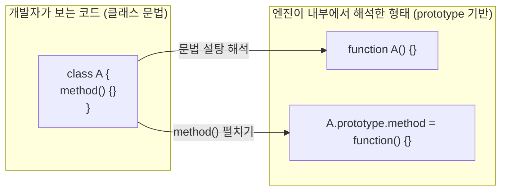
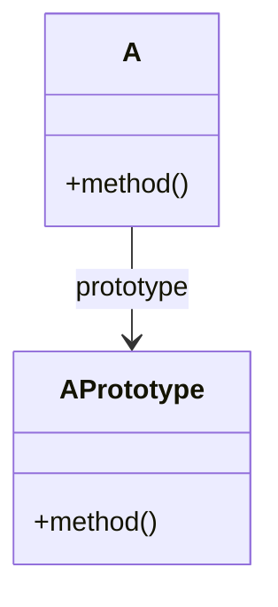
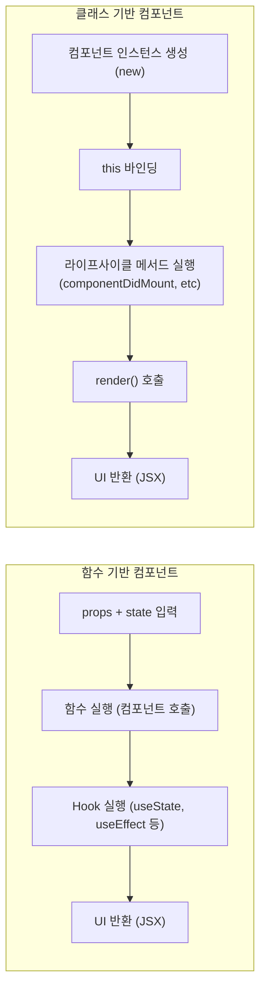

# 프론트엔드에서 함수 기반(Function-based)이 기본이 된 이유와 클래스의 역할
과거 리액트에서는 **클래스 컴포넌트가 기본 문법**이었고, 지금도 여전히 지원된다.  
또한 ES6(ES2015) 이후 자바스크립트가 `class`키워드를 **공식적으로 문법으로 제공**하면서  
겉으로 보기에는 자바나 C#처럼 “클래스 기반 언어”처럼 쓸 수 있게 되었다.

나 역시 JS를 배울 때 클래스 문법을 배웠고 알고리즘/코딩테스트 문제 풀 때(자료구조 구현 등)를 제외하면 실제 웹 프론트엔드 코드에서는 클래스를 쓸 일도, 예제를 접할 기회도 거의 없었다.  

`공식 문법도 있고, React도 옛날엔 클래스 썼다는데… 왜 실제 프론트 개발에서는 함수만 보이는 걸까?`라는 의문에서 이 정리를 시작했다.

프론트엔드에서 클래스 문법을 못 써서 안 쓰는 것이 아니라 함수 기반 접근이 훨씬 자연스럽고 실용적이기 때문에 React는 함수형 패러다임을 중심으로 발전해왔다.

## React Hooks 등장 이후 클래스의 주요 사용처가 사라짐
`React v16.8`이후 `useState`, `useEffect`등 `훅(Hooks)`이 도입되면서 기존 클래스 컴포넌트에서만 
가능했던 기능(`상태 관리`, `생명주기 관리`, `사이드 이펙트 처리`)들이 전부 함수 컴포넌트에서도 가능해졌다.

결과 → `함수로 다 되는데 굳이 클래스 쓸 필요가 없다`는 흐름이 강해짐.

## JavaScript의 클래스는 사실 `syntax sugar`
JS의 클래스는 전통적인 객체지향 클래스가 아니라 `prototype`기반 `상속`을 보기 좋게 감싸놓은`syntax sugar`다.

프론트엔드 UI 코드는 유연성과 조립성이 중요하기 때문에 자연스럽게 함수 기반 조합 패턴으로 기울어짐.

```js
class A {
  method() {}
}

// 사실상 아래와 동일한 구조
A.prototype.method = function () {};
```
→ JS의 클래스는 OOP처럼 보이지만 내부적으로는 함수+프로토타입 조합이다.

→ 상속 기반 구조(OOP): 유연하지 않음

→ 조합(Composition): 훨씬 자연스럽고 JS와 잘 맞음

> **문법 설탕(Syntax Sugar)이란?**
> - 없어도 언어가 돌아가는 기능이지만 개발자가 읽고 쓰기 쉽게 하기 위해 `추가로 제공하는 편의 문법`
> - **엔진 입장에서는 결국 같은 코드**로 변환된다.
> - 사람 눈에는 깔끔하게 내부 구현은 기존 메커니즘을 그대로 사용.

### JavaScript 클래스의 syntax sugar 구조


### 클래스와 prototype 관계



## React 자체가 함수형 패러다임을 밀어줌
React 공식 문서에서도 함수 컴포넌트 사용을 기본 권장한다.
- UI = `상태 → UI`형태로 계산하는 함수적 사고가 자연스럽다
- this 바인딩 문제 없음 
- 코드량 감소, 가독성 증가
- 커스텀 훅을 통한 상태 로직 재사용 쉬움
```js
function Button({ label }) {
  return <button>{label}</button>;
}
```

## 실무에서 함수 기반 패턴이 많은 이유
프론트엔드는 데이터 흐름 + 이벤트 + UI 상태 변화가 중심이다.

이런 문제는 작은 함수들을 조합하는 방식이 훨씬 자연스럽다.
- 커스텀 훅 (useForm, useAuth 등)
- 유틸리티 함수 (데이터 변환, API 파싱)
- 전략 패턴(Strategy) → 함수 매핑만으로 처리
- 팩토리 함수 (객체 생성, 설정 주입)

→ 클래스보다 훨씬 가볍고 단순하며 조립성이 뛰어남.

## 그렇다면 클래스는 언제 쓸까?
UI에서는 잘 안 쓰이지만 비즈니스 계층에서는 클래스가 더 자연스럽다.

→ UI는 함수형

→ 도메인, 엔진, 상태머신은 클래스형이 자연스럽다.

| 쓰임새                         | 클래스가 적합한 이유                                 |
| --------------------------- | ------------------------------------------- |
| **도메인 모델 (Domain Model)**   | 데이터 + 규칙 + 행위를 하나의 단위로 묶기 좋음                |
| **Service / Manager**       | API 호출/의존성/흐름 등을 ‘행위 단위’로 묶을 때              |
| **WebSocket / RTC / 상태 머신** | 연결/상태/전이 등 라이프사이클 관리 필요                     |
| **Canvas / 게임 오브젝트**        | “하나의 실체”가 있고 상태·행위가 명확히 묶여야 함               |
| **엔진/SDK 계층**               | three.js, PixiJS, Babylon.js 등 클래스 중심 구조 채택 |

## 실제 OSS에서도 여전히 클래스 쓰는 영역
2024~2025 기준으로 클래스 중심으로 설계된 대표적인 공개 리포지토리들

→ UI 프레임워크(React)는 함수 기반이지만 엔진/도메인/플랫폼 계층은 클래스가 지금도 표준.
- three.js (3D 엔진)
- PixiJS (2D 엔진)
- Babylon.js (WebGL/WebGPU, Physics)
- Mapbox GL / MapLibre (지도 엔진)
- Lit / Web Components (디자인 시스템용)
- Angular (18 기준, 모든 구성요소가 클래스 기반)

## 실무 관점에서 `클래스가 진짜 필요한 위치`
UI는 함수형으로 충분하지만 규칙, 상태, 흐름을 캡슐화해야 하는 영역은 클래스가 훨씬 이득이다.

### 도메인 모델 예시(UI에 로직이 섞인 안 좋은 예)
→ 규칙이 UI에 녹아 있어 유지보수, 테스트 불리
```js
setCart(prev =>
  prev.map(item =>
    item.id === id ? { ...item, qty: item.qty + 1 } : item
  )
);
```

### 도메인 모델 예시(도메인 모델로 분리한 좋은 예)
- API 변경되어도 UI는 영향 없음
- 테스트 쉬움
- 비즈니스 로직이 UI와 분리됨
- 타입 안정성 증가
```js
class CartItem {
  constructor(public id: string, public price: number, public qty: number) {}

  increase() {
    return new CartItem(this.id, this.price, this.qty + 1);
  }

  get total() {
    return this.price * this.qty;
  }
}

class Cart {
  constructor(private items: CartItem[]) {}

  increaseItem(id: string) {
    return new Cart(
      this.items.map(i => (i.id === id ? i.increase() : i))
    );
  }

  get total() {
    return this.items.reduce((sum, i) => sum + i.total, 0);
  }
}

// UI 코드
const [cart, setCart] = useState(new Cart([...]));
const onIncrease = id => setCart(prev => prev.increaseItem(id));
```

## 함수 기반 vs 클래스 기반 비교

### 함수형 흐름
- 매 렌더마다 그냥 함수를 다시 호출한다
- 상태는 Hook이 `함수 호출 간`유지
- 로직이 단순함
- this 없음

### 클래스형 흐름
- 먼저 인스턴스를 생성해야 하고
- this 바인딩이 필수
- 상태는 인스턴스 내부에 저장됨
- 라이프사이클에 따라 메서드가 여러 단계로 나뉨