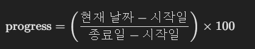

## 프로젝트 진행률 계산 및 ProgressBar 적용 가이드
이 문서는 프로젝트 진행률을 계산하고 ProgressBar 컴포넌트에 적용하는 방법을 설명합니다.   
기본적으로 프로젝트의 시작일(startDate)과 종료일(endDate)을 기반으로 현재 진행률(%)을 계산하여 표시합니다.

<br/>

## 진행률(%) 계산 공식

- 현재 날짜(today): new Date()로 현재 날짜를 가져옴 
- 시작일(startDate), 종료일(endDate): Date 객체로 변환하여 비교 
- 백분율(%) 계산: (현재 날짜 - 시작일) / (전체 기간) × 100

### 예외 처리
- 현재 날짜가 시작일 이전이면 0% 
- 현재 날짜가 종료일 이후이면 100% 
- 진행률은 항상 0 ~ 100% 범위를 유지 (Math.min(100, Math.max(0, progress)) 적용)

<br/>

## 진행률 계산 함수 (getProgress)
```ts
export const getProgress = (startDateStr: string, endDateStr: string): number => {
  const startDate = new Date(startDateStr).getTime(); // 시작일 (밀리초)
  const endDate = new Date(endDateStr).getTime(); // 종료일 (밀리초)
  const today = new Date().getTime(); // 현재 날짜 (밀리초)

  if (today < startDate) return 0; // 시작 전이면 0%
  if (today > endDate) return 100; // 종료 후이면 100%

  const progress = ((today - startDate) / (endDate - startDate)) * 100;
  return Math.min(100, Math.max(0, progress)); // 진행률을 0~100%로 제한
};
```
- 밀리초(ms) 단위로 날짜 차이를 계산하여 진행률을 정확하게 구함 
- 0% ~ 100% 범위 유지 
- parseFloat(progress.toFixed(2))를 사용하여 소수점 2자리까지 표현 가능

<br/>

## ProgressBar 컴포넌트 적용
```ts
import React from "react";

const ProgressBar = ({
  percentage
} : {
  percentage: number
}) => {
  return (
    <div className="w-full bg-gray-200 h-2 rounded mt-2">
      <div
        className="h-2 bg-primary rounded transition-all duration-500"
        style={{ width: `${percentage}%` }}
      ></div>
    </div>
  );
};

export default ProgressBar;
```
- percentage 값을 width: ${percentage}%로 반영하여 시각적으로 표시 
- 부드러운 진행 애니메이션을 위해 transition-all duration-500 추가 
- 0% ~ 100% 진행률만 허용하도록 percentage 타입을 number로 제한

<br/>

## 상위 컴포넌트에서 ProgressBar 적용
```ts
import React from "react";
import ProgressBar from "../ProgressBar";
import { getProgress } from "@/service/getProgress";

const ProjectInfo: React.FC<ProjectInfo> = ({ data }) => {
  const progress = parseFloat(getProgress(data.startDate, data.endDate).toFixed(2)); // 🔥 진행률 계산

  return (
    <div className="bg-white p-8 rounded-lg shadow">
      <h2 className="text-2xl font-semibold">프로젝트 진행률</h2>
      
      {/* 진행률 표시 */}
      <div className="mt-6">
        {new Date().toISOString().split("T")[0] >= data.startDate ? (
          <ProgressBar percentage={progress} />
        ) : (
          <p>프로젝트 시작 전</p>
        )}
      </div>
    </div>
  );
};

export default ProjectInfo;
```
- getProgress()를 활용하여 진행률을 계산하고 ProgressBar에 전달 
- 현재 날짜가 startDate보다 크거나 같으면 ProgressBar 렌더링, 그렇지 않으면 "프로젝트 시작 전" 표시