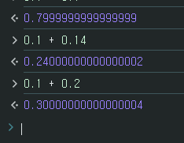

### JS 에서 부동 소수점의 특징

---
자바스크립트를 사용하면서 가끔 실수연산을 진행할 때가 있다.
최근 자바스크립트 문제를 풀며 헷갈련던 부분이기에 기록하였다.
  
예를들어 자바스크립트를 사용해 다음과 같은 연산을 진행한다고 가정한다.
```javascript
let floatJs = 0.1 + 0.2;
console.log(floatJs === 0.3);
```
  

  
결과는 true 같지만 실제 연산결과는 0.30000...4가 출력된다.

이런 오류가 생기는 원인은 컴퓨터는 0과 1만 사용하는 2진법을 사용하기 때문이다.
10진법을 2진법으로 바꾸는 `변환 과정`이 필요한데 소수 중 일부는 이 과정에서 `무한 소수`가 되어버린다. 하지만 메모리는 한계가 있기 때문에 무한 소수를 다 담지 못하고 `중간에 잘라서 유한 소수로 저장`해버린다.

이 과정에서 미세한 오차가 발생하며 다음과 같은 오류가 발생한다.

- 정밀도 손실  
  2진수로 소수를 표현할때, 소수점 이하 자릿수가 무한히 반복되는 경우가 발생할 수 있다. 하지만 실제로는 유한 자리수로 처리해야하기 때문에 일부 자릿수는 생략되어 정밀도가 떨어진다.  
  

- 반올림 오차  
  부동 소수점 방식으로 오류를 처리할때, 소수점 이하 자리수를 반올림하여 반올림할 자릿수 이하의 값에 따라 결과가 달라질 수 있다. 따라서 연산 결과에 오차가 발생하는 경우가 있으며 이때 대소 비교에서 오차가 발생할 수 있다.

  
### <br>해결 방법

---
#### toFixed()로 자릿수 결정하기
`toFixed()`메서드는 입력받은 숫자를 매개변수만큼 자릿수를 반올림해 String 으로 반환해준다. 즉, 매개변수는 소수점의 몇번째 자리까지 나타낼지를 의미한다. (0 ~ 20까지 입력 가능)

 문자열로 변환되기 때문에 `number`타입으로 사용하고 싶다면 `Number()`메서드를 사용하거나 `+`기호를 사용해서 숫자로 변환해야한다.
 
#### <br>Math.round()로 반올림하기
`Math`객체에 존재하는 Math.floor, Math.ceil, Math.trunc, Math.round 등의 메서드를 사용하면 소수연산을 수행할 수 있다.

`Math.round()`는 반올림을 수행하는 함수로 인자로 받은값을 반올림한 다음, 가장 근접한 정수값을 반환한다.