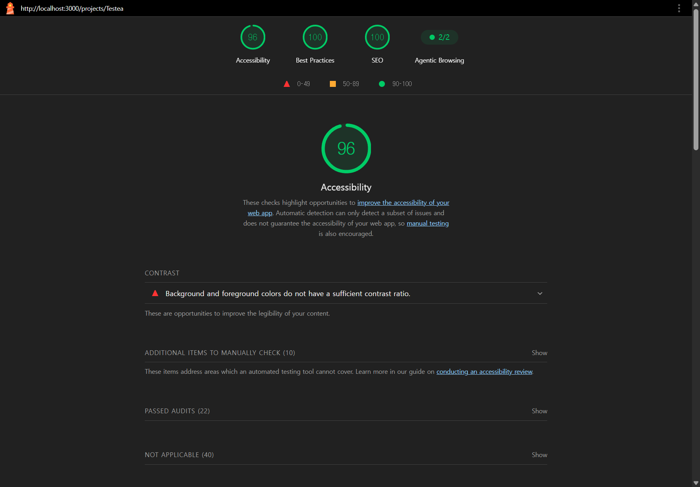

# Server Prefetch & 초기 성능 최적화 (측정 없이 짰던 코드의 청구서)

이번 작업은 단순한 성능 최적화 작업이 아니라 **"써보기 전엔 모르는 게 있다"는 걸 비싼 값에 배운 경험**이었다.

베타 릴리스가 끝나고 처음 며칠은 기능을 더 채우는 데만 신경 썼다. 그러다 내 서비스를 실제 사용자처럼 쭉 돌려봤다. 케이스를 만들고, 스위트 목록을 열고, 마일스톤으로 넘어가고. 기본적인 흐름을 따라가는데 매 화면 전환마다 로딩 스피너가 꼬박꼬박 등장했다. 사이드바를 누르면 빈 화면이 한 박자 보이고, 새로고침하면 데이터가 표시되기까지 또 한 박자가 있었다.

> 만드는 동안엔 모를 수 있다. 그런데 일단 써보면 못 본 척 못 한다.

## 빈 껍데기로 내려가던 HTML

DevTools Network 탭을 열고 나서야 원인이 보였다. 모든 페이지가 `'use client'` + `useQuery` 조합이었다. 브라우저가 HTML을 받아도 그 안엔 데이터가 없었다. JS 번들이 다운로드되고, 파싱되고, 하이드레이션이 끝난 뒤에야 비로소 API 요청이 시작됐다.

```
[브라우저]                              [서버]
  HTML 다운로드 (빈 껍데기)     ───>
  JS 번들 다운로드              ───>
  JS 파싱 & 실행
  React 하이드레이션
  useQuery → API 호출           ───>    DB 쿼리
  데이터 수신                   <───    응답
  UI 렌더링 (데이터 표시)
```

여기에 한 가지가 더 얹혀 있었다. 대시보드 페이지는 `slug → dashboardStats → projectId → testCases / testRuns` 순서로 쿼리가 줄지어 실행됐다. dashboardStats는 통계 집계까지 들어가 있는 무거운 쿼리인데, 이게 끝나야 비로소 `projectId`를 알 수 있고, 그제서야 나머지 쿼리가 출발했다. 전형적인 **데이터 워터폴**이었다.

서버 컴포넌트라는 무기를 손에 쥐고도 거의 쓰지 않고 있었다. Next.js를 사실상 리액트처럼 쓰고 있었던 셈이다.

## 서버 prefetch + Hydration: 이론으로만 알던 패턴

가장 먼저 손댄 건 페이지 진입 자체였다. TanStack Query의 `prefetchQuery` + `HydrationBoundary` 조합으로, 서버에서 데이터를 미리 채워서 HTML에 박아넣고 클라이언트에서는 그 캐시를 그대로 재사용하는 방식이다. 이름은 익숙했지만 실제로 적용해보는 건 처음이었다.

9개 `page.tsx`를 전부 async Server Component로 바꿨다.

```tsx
// Before — 빈 껍데기 HTML + 클라이언트에서 전부 페칭
const ProjectDashboardRoute = () => {
  return <ProjectDashboardView />;
};

// After — 서버에서 데이터 prefetch → HTML에 포함
export default async function ProjectDashboardRoute({
  params,
}: {
  params: Promise<{ slug: string }>;
}) {
  const { slug } = await params;
  const queryClient = new QueryClient({
    defaultOptions: { queries: { retry: false, staleTime: 60 * 1000 } },
  });

  try {
    const statsData = await queryClient.fetchQuery(dashboardQueryOptions.stats(slug));
    const projectId = statsData?.success ? statsData.data.project.id : undefined;

    if (projectId) {
      await Promise.all([
        queryClient.prefetchQuery(testCasesQueryOptions(projectId)),
        queryClient.prefetchQuery(testRunsQueryOptions(projectId)),
        queryClient.prefetchQuery(dashboardQueryOptions.storageInfo(projectId)),
      ]);
    }
  } catch {
    // prefetch 실패 시 클라이언트에서 재시도
  }

  return (
    <HydrationBoundary state={dehydrate(queryClient)}>
      <ProjectDashboardView />
    </HydrationBoundary>
  );
}
```

써보면서 가장 좋았던 점은 **기존 클라이언트 코드를 하나도 안 건드려도 된다**는 거였다. 클라이언트의 `useQuery`는 캐시에 데이터가 있으면 그냥 그걸 쓴다. 즉 서버가 캐시만 채워주면 끝이다. 클라이언트 컴포넌트들은 자기가 어떻게 더 빨라졌는지도 모르는 채로 빨라졌다.

또 하나는 `try-catch`로 감싼 부분이었다. prefetch가 실패해도 페이지 렌더링은 안 막힌다. 그냥 클라이언트가 평소처럼 한 번 더 요청할 뿐이다. "있으면 좋고, 없어도 동작하는" 최적화 레이어로 설계했다. 처음 SSR을 다루면서 가장 두려운 게 "서버에서 무너지면 화면 자체가 안 보이는 것"인데, 이걸 명시적으로 회피하니 마음이 편했다.

### read까지 Server Action으로 묶은 이유

prefetch 코드를 깔면서 한 가지 의문이 생겼다. `queryFn: () => getDashboardStats({ slug })`에서 부르는 `getDashboardStats`는 사실 `'use server'`가 붙은 **Server Action**이다. Server Action은 보통 mutation(쓰기)용으로 쓰는 거 아닌가?

이유는 단순했다. **서버의 `prefetchQuery`와 클라이언트의 `useQuery`가 같은 함수를 공유**해야 했다. 일반 서버 함수(`async function`)는 클라이언트에서 못 부르니, read를 분리하려면 API endpoint를 따로 파야 한다. Server Action으로 통일하면 `queryFn` 하나로 서버·클라이언트 양쪽이 커버된다. 코드 중복이 줄고, 권한 체크 같은 로직도 함수 안에 한 번만 둔다.

다만 트레이드오프가 있다. Server Action은 내부적으로 POST 요청(RSC payload)이라 **HTTP 캐시를 활용하기 어렵다**. read를 GET endpoint로 분리했다면 `Cache-Control`이나 CDN 캐시를 깔 수 있는데, 현재 구조에선 그게 안 된다.

지금 규모에선 통일이 더 합리적이지만, 트래픽이 커지고 캐시 가능한 read가 명확해지면 그때 endpoint를 분리하는 게 다음 단계가 될 것 같다.

> 같은 함수를 서버와 클라이언트 양쪽에서 부를 수 있게 만든 게 App Router의 가장 실용적인 변화 중 하나라고 본다.

### 클라이언트가 API를 다시 안 부른다

적용 후 대시보드 진입 시 Network 탭에서 fetch/xhr 요청을 세어보니 다음과 같았다.

| 요청 종류 | 건수 | 비고 |
| --- | --- | --- |
| HTML document | 1 | 데이터 포함된 RSC HTML |
| RSC payload | 2 | App Router prefetch |
| `fetch` / `xhr` (API) | **0** | 클라이언트가 데이터 재요청 안 함 |
| Sentry monitoring | 5 | observability, 핵심 흐름 무관 |
| Analytics | 1 | GA collect |

> 측정 환경: localhost, `next build` + `next start` (production 모드), 2026-05-13 재측정

**fetch/xhr 0건**이 prefetch + HydrationBoundary의 효과를 가장 직관적으로 보여준다. 클라이언트는 페이지를 받는 순간 이미 데이터를 다 알고 있다.

> 처음엔 SSR/Server Component가 막연하게 어렵다고만 생각했는데, 막상 해보니 prefetch + HydrationBoundary 조합은 의외로 직관적이었다. "이걸 왜 이제야 썼지" 싶을 정도였다.

## 워터폴을 끊기 위해 가벼운 쿼리를 새로 팠다

prefetch를 깔아두고 보니 그래도 대시보드 진입이 살짝 굼떴다. 원인은 명확했다. `projectId`를 얻기 위해 무거운 `dashboardStats`가 완료되어야 했고, 그게 끝나야 나머지가 출발했다. 워터폴이 그대로였다.

해결책은 단순했다. **`projectId`만 가져오는 가벼운 쿼리를 따로 만들었다.**

```tsx
// Before — dashboardStats가 끝나야 projectId를 알 수 있음
const { data: dashboardData } = useQuery(dashboardQueryOptions.stats(slug));
const projectId = dashboardData?.success ? dashboardData.data.project.id : undefined;

// After — 단순 SELECT로 projectId만 먼저 확보
const { data: projectIdData } = useQuery(projectIdQueryOptions(slug));
const projectId = projectIdData?.success ? projectIdData.data.id : undefined;
```

집계 쿼리를 기다리는 대신 단순 SELECT 하나로 `projectId`를 빠르게 받고, 그 즉시 `testCases`·`testRuns` 같은 후속 쿼리들이 병렬로 출발한다. dashboardStats도 같이 돈다. "데이터를 더 빠르게 가져오는 것"이 아니라 "가져오는 순서를 재배치하는 것"으로 체감 속도가 또 한 단계 줄었다.

이 작업을 하면서 깨달은 건, **워터폴은 보통 쿼리 한 개의 무게가 아니라 의존 관계 때문에 생긴다**는 점이었다. 무거운 쿼리를 가볍게 만들기보다, 의존 관계를 끊을 수 있는 가벼운 쿼리를 새로 파는 게 더 효과적인 경우가 많았다.

## 호버 prefetch (코드 몇 줄에 체감이 가장 컸다)

여기서부터는 사실 "장난 삼아 넣어본" 변경이었다. 사이드바 메뉴에 마우스를 올리면(`onMouseEnter`) 해당 페이지에 필요한 쿼리를 미리 가져오는 거다.

```tsx
const PREFETCH_MAP: Record<string, (projectId: string) => QueryOptions> = {
  '테스트 케이스': (pid) => testCasesQueryOptions(pid),
  '테스트 스위트': (pid) => testSuitesQueryOptions(pid),
  '마일스톤': (pid) => milestonesQueryOptions(pid),
  '테스트 실행': (pid) => testRunsQueryOptions(pid),
};

const handlePrefetch = useCallback((label: string) => {
  const optionsFn = PREFETCH_MAP[label];
  if (!optionsFn) return;

  const statsData = queryClient.getQueryData(dashboardQueryKeys.stats(projectSlug));
  const projectId = statsData?.success ? statsData.data.project.id : undefined;
  if (!projectId) return;

  queryClient.prefetchQuery(optionsFn(projectId));
}, [queryClient, projectSlug]);
```

사용자가 메뉴 위에 마우스를 올리고 나서 실제 클릭까지 평균 200~400ms가 걸린다. 그 시간 동안 백그라운드로 데이터를 가져오면, 클릭 시점엔 이미 캐시에 데이터가 있어 로딩 없이 화면이 즉시 그려진다.

> 처음엔 "이게 정말 체감될까?" 싶었는데, 적용하고 나서 페이지가 진짜 즉시 넘어가는 걸 보고 좀 놀랐다.

코드는 30줄 정도였는데, 시리즈 전체에서 가장 큰 체감 차이를 만든 변경이었다. **사용자 의도를 0.2~0.4초 먼저 예측하는 것만으로 로딩 스피너가 안 보이는 화면**이 만들어진다. 이걸 직접 보고 나서야 "투기적 최적화(speculative optimization)"라는 용어가 왜 따로 있는지 이해됐다.

## 폰트 외부 CDN을 끊었다

성능 작업과는 좀 결이 다르지만 같은 PR에 묶어 처리한 게 있다. Pretendard 폰트를 jsdelivr CDN의 `<link rel="stylesheet">`로 받고 있었다. 외부 DNS 조회 → TCP 연결 → TLS 핸드셰이크 → CSS 다운로드 → 폰트 파일 다운로드까지 렌더가 차단되는 구조였다.

```tsx
// Before — 외부 CDN
<link rel="stylesheet" href="https://cdn.jsdelivr.net/gh/orioncactus/pretendard@v1.3.9/dist/web/static/pretendard-dynamic-subset.css" />

// After — next/font/local로 빌드타임 번들링
const pretendard = localFont({
  src: '../public/fonts/PretendardVariable.woff2',
  display: 'swap',
  weight: '45 920',
  variable: '--font-pretendard',
});
```

`next/font/local`은 빌드 시점에 폰트를 번들에 포함시키므로 런타임 비용이 0이다. `display: 'swap'`으로 폰트 로드 전에도 텍스트가 바로 표시되고, 가변 폰트(Variable Font) 하나로 모든 weight를 커버하니 파일 수도 줄었다.

이건 사실 처음부터 이렇게 했어야 하는 거였다. **외부 CDN은 편하지만, 그 편함은 사용자의 첫 화면 시간을 깎아서 만들어진다**는 걸 이번에 다시 새겼다.

## 무심코 깔아둔 60초의 정체

`staleTime`을 들여다보니 거의 모든 쿼리가 기본값 60초 또는 5분이었다. 데이터의 변경 빈도와 전혀 상관없는 획일적인 설정이었다.

```ts
export const QUERY_STALE_TIME_SHORT = 1000 * 30;       // 30초 — 활발히 변경되는 데이터
export const QUERY_STALE_TIME_DEFAULT = 1000 * 60 * 5; // 5분 — 일반 데이터
export const QUERY_STALE_TIME_LONG = 1000 * 60 * 30;   // 30분 — 거의 안 변하는 데이터
```

| 데이터 | Before | After | 근거 |
|--------|--------|-------|------|
| 프로젝트 ID (slug→id) | — | Infinity | 불변 데이터 |
| 스위트 목록/상세 | 60초 | 5분 | 구조는 자주 안 변함 |
| 마일스톤 목록/상세 | 60초 | 5분 | 동일 |
| 저장 용량 정보 | 5분 | 30분 | 파일 업로드 시에만 변경 |
| 테스트 실행 목록 | 60초 | 60초 (유지) | 활발히 변경되는 데이터 |

매직넘버로 흩어져 있던 60초·5분을 상수로 묶은 것도 부수 효과였다. `QUERY_STALE_TIME_DEFAULT`라는 이름만 봐도 의도가 전달되니 다른 사람(또는 미래의 나)이 코드를 읽을 때 한 번 덜 멈춘다.

> 무심코 깔아둔 기본값들은 "지금은 안 보이지만 누군가는 비용을 내고 있는" 부채다.

## Barrel Import의 함정 (서버 컴포넌트에서 처음 만난 벽)

prefetch를 깔다가 갑자기 컴파일이 무한히 도는 현상을 만났다. 처음엔 Next.js 설정 문제인 줄 알았는데, 원인은 의외였다.

```ts
// 무한 컴파일을 유발하던 import
import { getDashboardStats } from '@/features';

// 직접 경로로 바꿔 해결
import { getDashboardStats } from './get-dashboard-stats';
```

Server Component에서 `@/features` 같은 barrel을 import하면 그 모듈이 export하는 **모든 것**이 평가된다. 그 안에 `'use client'` 컴포넌트가 끼어 있으면 서버 번들이 클라이언트 컴포넌트까지 끌고 들어가려다 무한 루프에 빠진다. 클라이언트 컴포넌트에서는 tree-shaking이 알아서 정리해주니 평소엔 문제가 안 됐다.

이걸 한 번 만나고 나서 `@/shared`의 `export * from`을 전부 명시적 export로 바꿨다. 짧은 작업이었지만 의미가 컸다. **App Router 환경에서 모듈 경계는 단순한 스타일 문제가 아니라 빌드 파이프라인의 일부**라는 걸 이번에 처음 알았다.

## [Lighthouse] 처음 측정한 점수

여기까지 다 적용하고 나서 Lighthouse를 처음 돌렸다.

| 지표 | 측정값 |
|------|--------|
| Performance Score | 77 |
| FCP | 1.0초 |
| LCP | 2.2초 |
| TBT | 70ms |
| CLS | 0.001 |
| Speed Index | 4.6초 |

> 측정 환경: localhost, `next build` + `next start` (프로덕션 모드), Chrome DevTools Lighthouse, 2026-03-03

이 숫자를 보면서 가장 후회한 게 한 가지 있다. **최적화 전엔 측정을 안 했다**는 점이다. 그래서 "이번 작업으로 얼마나 좋아졌는지"를 수치로 말할 수 없게 됐다. 호버 prefetch 같은 건 Lighthouse가 잡아내지도 못한다. 사용자 시점의 페이지 전환은 SPA 라우팅이라 초기 로드만 측정하는 도구로는 안 보인다.

지금 호버 prefetch의 효과는 "마우스 올리고 클릭하면 스피너가 거의 안 보임" 수준으로만 정성적으로 확인된 상태다. 다음 작업에서는 `performance.mark()`로 페이지 전환 시간을 직접 계측하기로 다짐했다.

### 다시 측정해보기

2026-05-13에 같은 페이지를 다시 측정했다. 두 달 사이 다른 기능들이 누적된 상태에서의 후속 베이스라인이다.



| 지표 | 2026-03-03 | 2026-05-13 | 비고 |
| --- | --- | --- | --- |
| LCP | 2.2초 | **260ms** | 캐싱·호스트 영향, prod 환경에선 다를 수 있음 |
| CLS | 0.001 | **0.17** | 두 달 사이 누적된 변경으로 후퇴, 별도 leverage 작업 필요 |
| TTFB | — | 85ms | prefetch + 캐시 효과 |
| Accessibility | — | 96 | |
| Best Practices | — | 100 | |
| SEO | — | 100 | |

> Lighthouse 13.3.0 / Slow 4G throttling / Emulated Desktop

CLS가 0.001 → 0.17로 후퇴한 게 가장 눈에 띈다. 처음 측정 이후 새 위젯·차트가 추가되면서 layout shift를 재유발한 것 같다. **한 번 좋게 만들어둔 지표는 두면 다시 나빠진다**는 걸 보여주는 사례다. 다음 leverage 작업의 대상으로 명시적으로 기록해뒀다.

## 회고 — 이번 작업이 알려준 두 가지

기술적으로 새로 배운 건 분명히 많았다. Server-side Prefetch + Hydration, 호버 기반 투기적 prefetch, barrel과 모듈 경계의 관계. 이전 같으면 책에서나 봤을 패턴들을 직접 깔아보고 효과를 눈으로 확인했다.

그런데 더 오래 남을 교훈은 따로 있다.

**첫째, 만드는 사람의 시점과 쓰는 사람의 시점은 다르다.**
같은 코드를 짠 내가 직접 써보기 전까진 이 문제가 안 보였다. "잘 동작하는 코드"와 "쓸 만한 제품"은 완전히 다른 차원이라는 걸 새삼 알았다. 앞으로는 큰 기능을 끝낼 때마다 한 번씩 사용자처럼 천천히 흐름을 따라가 보기로 했다.

**둘째, 측정 없는 개선은 자기만족이다.**
이번 작업에서 가장 아쉬운 게 Before 수치가 없다는 점이다. 결과는 좋았지만 그게 얼마나 좋은 결과인지는 모른다. 두 달 뒤 재측정에서 CLS가 후퇴한 걸 발견한 것도 측정을 다시 했기 때문에 가능했다. 다음 성능 작업은 무조건 측정 → 작업 → 재측정 순서로 가야 한다. 그게 처음엔 답답해 보여도 결국 본인의 작업을 본인이 평가할 수 있는 유일한 길이다.

> 좋은 코드를 짜는 건 출발선이고, 그 코드가 정말 좋아졌는지 증명하는 게 그다음이다.
