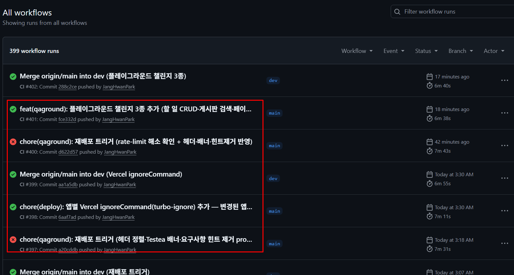
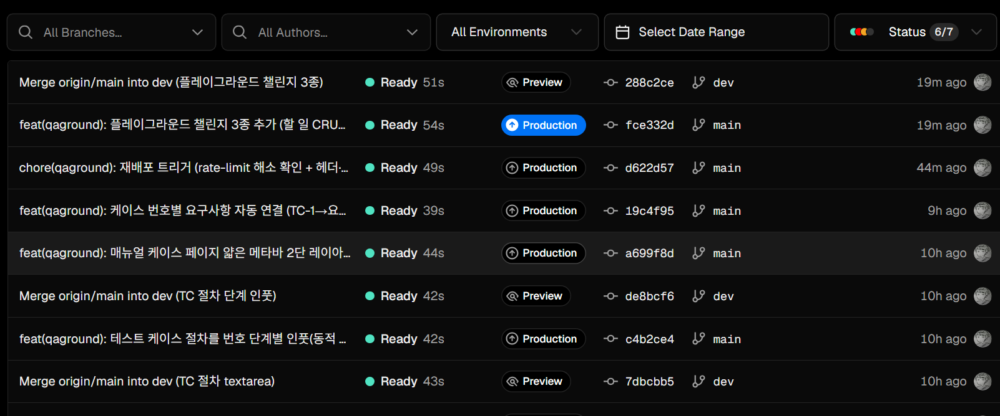
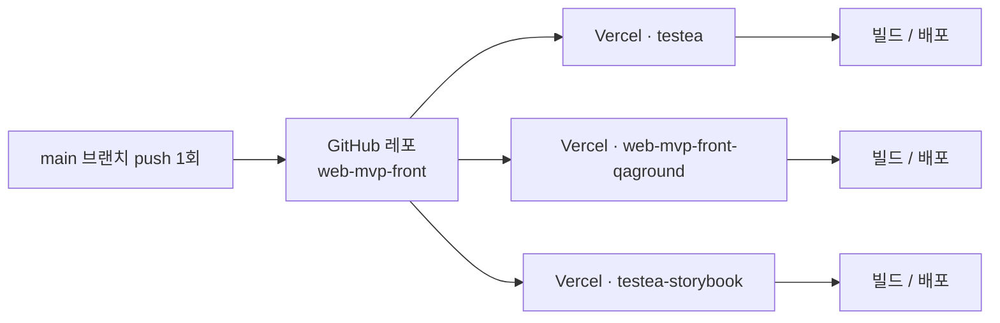
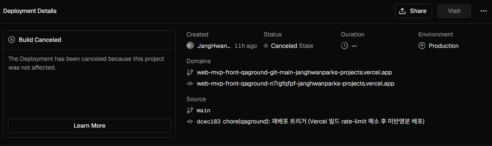
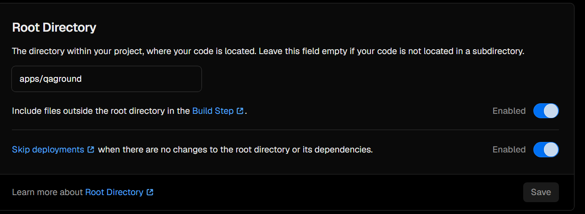

최근 작업 후 배포가 안되는 문제가 있었다. `main`브랜치에 `push`가 올라갔지만 `Vercel`배포가 생성되지 않았다. 원인을 찾아보니 하나의 `모노레포`에 `Vercel`프로젝트 3개를 연결해둔 구조 때문이었다. `Vercel`은 기본적으로 `push`1회 마다 연결된 모든 프로젝트를 각각 배포하기 때문에 잦은 `push`가 누적되며 `Vercel`의 배포 `rate limit`에 걸렸다.
> Hobby 플랜 기준 시간당 100빌드, 하루 100배포

<table>
  <tr>
    <td width="50%"><br/><sub><em>재배포 트리거로 도배된 GitHub 커밋들</em></sub></td>
    <td width="50%"><br/><sub><em>근데 Vercel엔 중간이 텅 비어있다</em></sub></td>
  </tr>
</table>

<br/>

## Rate Limit
`Rate Limit`은 일정 시간 동안 시스템이 처리할 수 있는 요청 수나 리소스 소비량을 제한하는 기술이다.

주의할 점은, `Vercel`에는 성격이 다른 두 종류의 rate limit이 있고 이번에 걸린 것은 흔히 떠올리는 그것과 다르다는 것이다.

### 1. 배포(빌드) rate limit (이번에 걸린 것)
내가 얼마나 자주 *배포를 생성*할 수 있는지에 대한 플랫폼 한도다. Hobby 기준 시간당 100 빌드, 하루 100 배포로 제한되며, 초과하면 새 배포 생성이 차단되고 일정 시간이 지나야 다시 가능해진다.

`git` 연동으로 `push`했을 땐 화면에 `429`가 직접 뜨지 않고 **배포가 아예 생성되지 않는 형태**로 나타난다. (REST API나 CLI로 직접 호출하면 이때 `HTTP 429`와 함께 `X-RateLimit-*` 헤더가 반환된다.)

### 2. 트래픽(WAF) rate limit (흔히 말하는 그것)
배포된 사이트나 API 엔드포인트에 *사용자(클라이언트)가* 일정 시간 동안 보낼 수 있는 요청 횟수를 제한한다. 한도를 넘으면 `HTTP 429`를 반환해 요청을 차단하며, 트래픽 폭주나 어뷰징을 막는 방화벽 기능에 가깝다.

이번 문제는 1번에 해당한다. "사이트에 요청을 많이 보낸" 게 아니라, "배포를 너무 자주 생성"해서 걸린 것이다.

<br/>

## 내 프로젝트에서
문제의 구조는 단순했다. GitHub 레포 하나(`DataArts-Studio/web-mvp-front`)에 `Vercel` 프로젝트 3개가 동시에 연결돼 있었다.

| Vercel 프로젝트 | 용도 | 프레임워크 | 배포 리전 |
|---|---|---|---|
| `testea` | 본 서비스 | Next.js | icn1 |
| `web-mvp-front-qaground` | QAground | Next.js | iad1 |
| `testea-storybook` | 스토리북 | 정적 호스팅 | - |



세 프로젝트의 `githubRepoId`가 전부 동일한 `1100180155`였다. 같은 레포를 바라보는 프로젝트가 3개라서 `main`에 한 번 `push`하면 빌드가 3개씩 동시에 생성됐다. 작업 기간 내내 잦은 `push`가 쌓이는 동안 평소 체감의 3배 속도로 일일 배포 한도를 깎아먹고 있었던 것이다.

<br/>

## 원인을 어떻게 확인했나
처음엔 트래픽을 많이 보내서 막힌 건가 싶었는데, 앞에서 나눠둔 두 종류의 rate limit을 하나씩 따져봤다.

먼저 트래픽 쪽 rate limit부터 확인했다. 세 프로젝트의 런타임 로그를 상태코드별로 집계해보니 `429`가 단 한 건도 없었다.

| 프로젝트 | 최근 7일 상태코드 | 429 |
|---|---|---|
| testea | 200 × 10 | 0 |
| qaground | 200 × 223, 304 × 8 | 0 |
| storybook | (정적, 런타임 로그 없음) | 0 |

런타임 `429`가 0이라는 건 사이트로 요청이 몰려서 생긴 문제가 아니라는 뜻이다. WAF 쪽이 아니라 배포 쪽이라는 걸 데이터로 확정한 셈이다.

다음으로 배포 이력을 봤다. 대시보드 Deployments 목록에는 push한 커밋의 배포가 아예 뜨지 않았다. 한도에 막혀 생성되지 않은 배포는 물론이고, 건너뛰어진 배포도 목록에서는 보이지 않았다. 대신 Vercel API로 배포 상세를 직접 조회하니 그 커밋들이 `CANCELED` 상태로 잡혔고, 사유 링크가 이렇게 찍혀 있었다.

```
state: CANCELED
errorLink: https://vercel.com/docs/monorepos#skipping-unaffected-projects
```

<p align="center">
  <br/>
  <sub><em>Inspector로 직접 들어가니 보이는 취소 사유: this project was not affected</em></sub>
</p>

여기서 한 가지 짚어야 할 게 있다. 막판에 본 `CANCELED`들은 엄밀히 말하면 배포 한도 초과가 아니라, 모노레포에서 해당 프로젝트와 무관한 변경은 빌드를 건너뛰는 Vercel의 자동 취소 동작이었다(skip unaffected projects). 빈 커밋으로 재배포를 강제하려던 시도가 오히려 그 프로젝트와 상관없는 변경으로 분류돼 취소된 것이다. 결국 같은 레포에 프로젝트 3개를 연결한 구조가 한도 소진과 자동 취소라는 두 증상을 동시에 만들어내고 있었다.

<br/>

## 해결
빈 커밋으로 재배포를 미는 건 한도만 더 깎는 악순환이라, 구조 자체를 끊는 쪽으로 갔다. 각 Vercel 프로젝트에 Root Directory를 지정해 자기 디렉터리만 바라보게 하고, Skip deployments 토글을 켜서 자기 디렉터리에 변경이 없으면 배포를 건너뛰게 했다. 이렇게 하면 storybook만 바뀐 커밋에 testea와 qaground가 따라서 빌드되는 일이 사라진다. 재배포가 필요할 때도 빈 커밋을 올리는 대신 대시보드의 Redeploy를 쓰면 한도를 소모하지 않고 같은 결과를 얻을 수 있다.

<p align="center">
  <br/>
  <sub><em>Root Directory 지정 + Skip deployments 토글 ON</em></sub>
</p>

이 설정을 잡고 나니 `push` 한 번이 3 빌드로 부풀던 게 실제 영향받은 프로젝트만 빌드되는 쪽으로 줄었고, 한도 압박과 monorepo 자동 취소가 함께 사라졌다.

<br/>

## 느낀 점
이번에 가장 크게 배운 건 증상만 보고 원인을 단정하면 안 된다는 점이다. 배포가 안 되는 걸 보고 막연히 rate limit이라 생각해 빈 커밋을 계속 밀었는데, 그게 한도를 더 깎고 monorepo 자동 취소까지 부르는 악순환이었다. 런타임 `429`를 직접 집계해서 트래픽 rate limit을 먼저 배제하고, 배포 이력의 `CANCELED` 사유 링크까지 열어보고 나서야 진짜 그림이 보였다. 로그와 메타데이터를 끝까지 확인하는 습관이 결국 시간을 아껴줬다.

두 번째는 같은 레포에 프로젝트를 여러 개 연결할 땐 Root Directory와 Skip deployments 설정이 선택이 아니라 필수라는 것이다. 처음 세팅할 땐 그냥 연결하면 알아서 되겠거니 했는데, Vercel은 기본적으로 연결된 모든 프로젝트를 매 `push`마다 빌드한다. 모노레포라면 이 설정을 처음부터 잡고 가야 불필요한 빌드와 한도 낭비를 막을 수 있다.

마지막으로 Vercel의 rate limit이 한 종류가 아니라는 걸 명확히 구분하게 됐다. 흔히 떠올리는 트래픽 쪽 `429`와 내가 걸린 배포 한도는 발생하는 위치도 증상도 다르다. 같은 단어라도 어디서 걸린 건지부터 나누고 봐야 엉뚱한 해결책에 시간을 쓰지 않는다.
