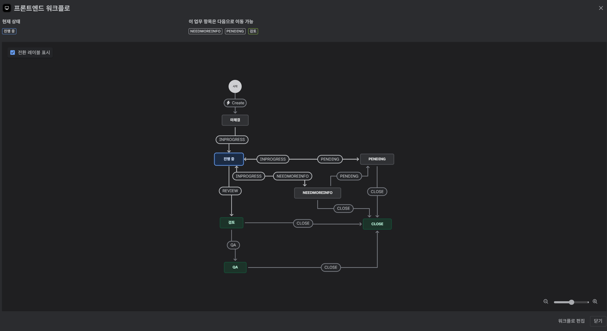
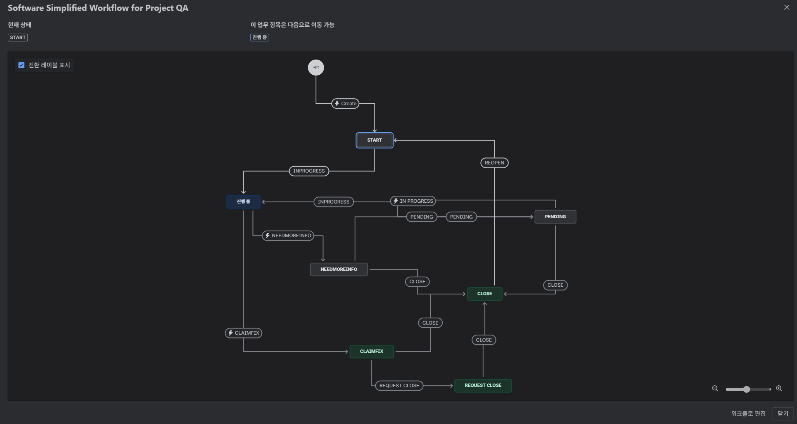
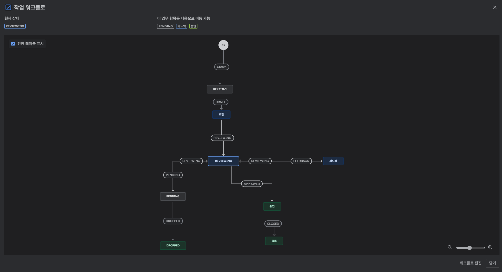

## 1. JIRA 워크플로우 및 프로젝트 구조 개선 회고
> 문제는 항상 코드가 아니라 프로세스에서 시작된다.

사이드 프로젝트를 진행하면서 어느 순간부터 이상한 피로감이 쌓였다. 하루 종일 작업을 했는데도 뭐가 끝난 느낌이 없고 티켓은 쌓이는데 진행 상황은 흐릿했다. 스프린트는 돌고 있었지만 그건 그냥 `주차별 일정표`였지 애자일은 아니었다.

이번 회고는 기존 팀의 비효율적인 Jira 프로세스를 근본적으로 재설계한 경험을 정리한 것이다.
단순한 워크플로우 정비가 아니라 `작업 단위의 정의 → 산출물 표준화 → 협업 루프 개선`까지 포함된 팀 레벨 프로세스 리빌드였다.

## 2. 작업은 많은데 진척이 없던 이유
한 달 정도 팀의 흐름을 지켜보면서 느낀 건 단순했다.
> 이건 협업이 아니라 각자 일하는 개인들의 병렬 처리였다.

표면적으로는 스프린트를 운영하고 있었지만, 실제로는 할 일을 모아둔 주간 계획표에 불과했다. 티켓 제목은 대부분 `회원가입 구현`, `API 연결`처럼 단편적이었고, 설명 없이 담당자나 완료 기준이 비어 있었다.

Epic과 Task는 형식상 존재했지만, Jira의 핵심인 티켓 추적, 상태 기반 워크플로우, 의존성 관리, 담당자별 히스토리는 제대로 작동하지 않았다.

누가 무엇을 맡았는지, 어떤 이슈가 어떤 기능과 연결되는지 한눈에 파악할 수 없었다. 결국 Jira는 `협업 도구`가 아니라 개인 투두리스트에 가까웠다.

QA팀도 따로 없었다. 기능 검증은 돌아가며 했지만 버튼 눌러보고 응답 확인하는 수준이었다. 체크리스트라고 부르기도 민망했다.

API 명세는 Swagger 하나뿐이었다. 그러나 Swagger는 요청/응답 구조만 보여줄 뿐, 무엇을 어떻게 검증할 것인지는 설명하지 않는다. 예를 들어 401이 로그인 실패인지 토큰 만료인지 구분 기준이 없었고, 회원가입 성공 후 어떤 단계로 넘어가는지 정의도 없었다.
이런 환경에서 테스트 케이스를 세우는 건 사실상 불가능했고, 피그마 시안과 실제 동작 일치 여부도 사람마다 해석이 달랐다.

QA부터 설계하려던 시도를 접고 깨달았다.
> 지금 이 구조 자체를 리빌드해야 한다.

## 3. 왜 프로세스를 갈아엎었는가
합류 당시 프로젝트는 여러 차례 스프린트를 거쳤지만, 실제로는 일정 중심 워터폴에 가까웠다. 기획, 디자인, 개발이 동시에 밀려들고 QA는 매번 뒤로 밀렸다. 결국 마지막 주는 `버그 수정 기간`이 되었고, 새 기능보다 누적된 `기술 부채`를 임시로 덮는 데 시간을 쓰는 구조가 반복되고 있었다.
실제 부채 상환은 거의 이뤄지지 않은 채, 문제는 점점 쌓여갔다.

문제는 속도가 아니라 방향이었다. `무엇을 언제까지 어떤 기준으로 완료`할지 정의가 없었고, Jira는 협업 도구로서 기능하지 못했다.

우리는 전업 팀이 아니어서 동기적 협업이 어려웠다. 그래서 시간 중심 스프린트를 포기하고 목표 중심 마일스톤으로 전환했다. 애자일의 핵심을 속도가 아닌 피드백 루프로 보고, `기능 단위로 완결되는 피드백 주기`를 설계했다.

마일스톤은 일정이 아닌 결과 단위(Deliverable) 로 정의했다. 각 마일스톤은 `명확히 측정 가능한 목표`만 담고, 기능별 작업은 FDD(Feature-Driven Development) 구조로 분해했다. 완전한 FDD 대신 워터폴의 순차 안정성과 FDD의 기능 단위 구조를 섞은 Light FDD 하이브리드를 채택했다.
핵심은 비동기 협업 최적화였다. 티켓이 `자가 설명적`이어야 했다: 담당자, 목적, 완료 기준은 필수, 커밋은 티켓과 연결, 코멘트는 논의가 아닌 `결정 기록`.

> 워크플로우의 구체 상태와 운영 원칙은 4.1에서 표로 정리했다.
 
각 워크플로우는 독립적으로 운영되지만 Epic 단위에서 연결된다. 기획이 승인되면 개발이 시작되고, 개발이 끝나면 QA 마일스톤이 열린다. 세 파트가 각자의 리듬으로 움직이면서도 전체는 하나의 플로우로 이어진다.

## 4. [리빌드] 팀의 지라를 완전히 갈아엎다
수십 개 티켓을 정리하는 일은 정리되지 않은 코드를 리팩토링하는 기분이었다. 제목뿐인 티켓, 비어 있는 완료 기준, 지정되지 않은 담당자, 희미한 코멘트 히스토리, 커밋 연동 부재. `무슨 일을 해야 하는지 알 수 없는 일감 목록`만 남아 있었다.

보드를 치우는 수준을 넘어 구조 자체를 실제 작업 흐름에 맞게 다시 설계했다.

기존 Epic → Story → Task → Subtask 구조에서, 사실상 비어 있던 Story를 제거했다. 대신 누락 방지와 검색성 강화를 위해 Feature와 Milestone 커스텀 필드를 추가하고 필수화했다. 구조는 단순화하되, 정보는 강제화했다.

### 4.1. [워크플로우 개선] 비동기 협업에 맞춘 3트랙 운영
기존 단일 플로우(`Open → In Progress → Done`)에서는 대부분의 작업이 In Progress에 몰렸고, 비동기 환경에서 답변 대기만으로 3~4시간, 길게는 하루 이상 펜딩이 발생했다. 특히 명세가 불충분하면 `멈춰야 하나`, `다른 일을 먼저 해야 하나`와 같은 판단 비용이 반복됐다.

그래서 상태를 통해 커뮤니케이션하도록 워크플로우를 재설계했다.  
워크플로우를 메인 개발 / QA(버그) / 프로덕트(RFP) 3트랙으로 분리하고, 서로 이슈 체이닝(issue linking) 으로 연결했다. 즉, `개발 → QA → 기획(RFP)`이 하나의 생명주기를 이룬다.

#### 4.1.1. 메인 프로젝트 (Development)

| 구분 | 상태명 | 설명 |
|------|---------|------|
| 시작 | **Start** | 티켓 생성 시 초기 상태 |
| 작업 | **In Progress** | 실제 개발이 진행 중인 상태 |
| 대기 | **Pending** | 외부 의존(답변, 리소스 등)으로 작업이 일시 중단된 상태 |
| 보완 | **Need More Info** | 명세나 자료가 부족하여 추가 정보가 필요한 상태 |
| 검토 | **Review** | 코드 리뷰 혹은 내부 승인 대기 단계 |
| 완료 | **Close** | 작업이 완전히 종료된 상태 |

메인 보드는 Epic과 포지션별 Task/Subtask를 관리하는 중심 보드다. 과거엔 모든 일이 In Progress에 몰려 병목 원인 추적이 어려웠다. 이제는 Pending과 Need More Info로 `왜 멈췄는가`를 표면화해 회의 없이도 진행 상황을 파악할 수 있다.

#### 4.1.2. 프로젝트 QA (Bug Tracking)

| 구분 | 상태명 | 설명 |
|------|---------|------|
| 시작 | **Start** | 버그 등록 시 초기 상태 |
| 재현 | **In Progress** | 버그 재현 및 분석 단계 |
| 보류 | **Pending** | 재현 불가 또는 관련 정보 대기 |
| 정보요청 | **Need More Info** | 명세/로그/환경 등의 추가 정보 필요 |
| 수정요청 | **Claim Fix** | 개발팀에 수정 요청 전달 |
| 검증요청 | **Request Close** | 수정 완료 후 QA 재검증 요청 |
| 완료 | **Close** | 버그가 검증 및 종료된 상태 |

QA 보드는 버그 티켓 전담을 위해 분리했다. 메인 보드의 QA/디버깅 Task와 반드시 체이닝하며, `재현 → 수정 → 검증`주기를 독립적으로 추적한다. 기능 개발과 품질 관리가 간섭 없이 진행되면서도, 마일스톤 품질 흐름은 연결된다.

#### 4.1.3. 프로덕트 (RFP / 기획 요청)

| 구분 | 상태명 | 설명 |
|------|---------|------|
| 초안 | **Draft** | 제안서 또는 아이디어 초안 단계 |
| 검토 | **Reviewing** | 검토 및 피드백 중 |
| 피드백 | **Feedback** | 보완 요청 단계 |
| 보류 | **Pending** | 반려 또는 논의 중단 상태 |
| 승인 | **Approved** | 개발 반영 승인 |
| 종료 | **Closed** | Epic으로 승격되어 메인 프로젝트로 이동 |

아이디어 및 기능 요청은 개발 보드와 분리해 우선순위 혼란을 방지했다. 승인된 RFP만 Epic으로 승격되어 메인 보드로 들어간다. 소규모 팀 특성상 추가 분리는 하지 않았지만 이 3트랙만으로도 흐름이 충분히 명확해졌다.

#### 4.1.4. 구조 요약 및 효과
워크플로우 리빌드를 통해 전체 Jira 구조는 다음과 같이 단순화되었다.
- **Epic** – 마일스톤 단위 (예: MS1(MVP1-A), MS2(MVP1-B))
- **Task** – 기능 구현 단위 (예: BE 로그인, FE 로그인, 회원가입 API 등)
- **Subtask** – 세부 실행 단위 (코드 리뷰, 리팩토링, 파이프라인 수정 등)

이 단순한 구조 덕분에 신규 팀원도 `어디에 어떤 티켓을 등록해야 하는가`를 바로 이해할 수 있게 되었고, 팀 전체의 진입장벽이 크게 낮아졌다.

또한 QA, 개발, 기획이 서로 다른 보드에서 독립적으로 움직이면서도 이슈 체이닝(issue linking)을 통해 하나의 유기적 흐름으로 연결되었다.  

QA 전용 프로젝트를 통해 버그 관리가 명확해졌고, 프로덕트(RFP) 프로젝트를 통해 아이디어 검토와 개발 반영이 분리되었다.

결국 이번 리빌드는 Jira를 단순히 정리한 것이 아니라, `팀이 일하는 방식을 시스템화한 일`이었다. 복잡한 구조를 제거하고 필요한 정보만 강제화함으로써 비동기 협업 환경에서도 집중력과 일관성을 유지할 수 있게 되었다.

## 변화와 배운 점
프로세스를 바꾼다고 코드가 즉시 좋아지진 않는다. 하지만 일하는 방식은 달라졌다.
과거엔 `빨리 만드는 것`이 목표였다면, 지금은 `명확하게 만드는 것`이 우선이다.

개발 속도보다 일의 방향과 기준이 명확해졌고, QA가 개발의 끝이 아니라 개발의 일부로 들어왔다.
마일스톤 중심 구조와 기능 단위 분리가 정착되면서, 팀원 모두가 `지금 우리가 어디에 있는가`를 쉽게 파악할 수 있게 되었다.

마일스톤 회고도 단순한 회의가 아니라 `이번 주에 팀이 무엇을 배웠는가`를 공유하는 문화로 바뀌었다.
누가 더 빨랐는지가 아니라, 무엇이 더 명확했는가가 새로운 기준이 되었다.

아직 이 변화가 수치로 드러나진 않는다.
현재는 데이터를 쌓아가며 개선 효과를 관찰하는 단계다.
하지만 한 가지는 분명하다. `팀은 이제 더 이상 감으로 일하지 않는다.`
> 프로세스는 문서가 아니라, 행동의 패턴이다.

좋은 프로세스는 사람을 통제하는 장치가 아니라 각자가 방향을 잃지 않게 해주는 나침반이다.
누군가의 속도를 맞추는 게 아니라, 각자의 리듬이 달라도 한 방향으로 나아가게 만드는 시스템이다.

결국 이번 Jira 개편은 `관리`가 아니라 `언어의 통일`이었다.
모호했던 기준을 언어화하고, 그 언어를 팀의 습관과 행동으로 녹여냈다.

돌아보면 이것은 단순한 도구 개선이 아니라, 팀이 스스로 일하는 방식을 재정의한 첫 번째 실험이었다.

이 경험을 통해 배운 건 명확하다.
> 모든 혼란은 정의되지 않은 것에서 온다.