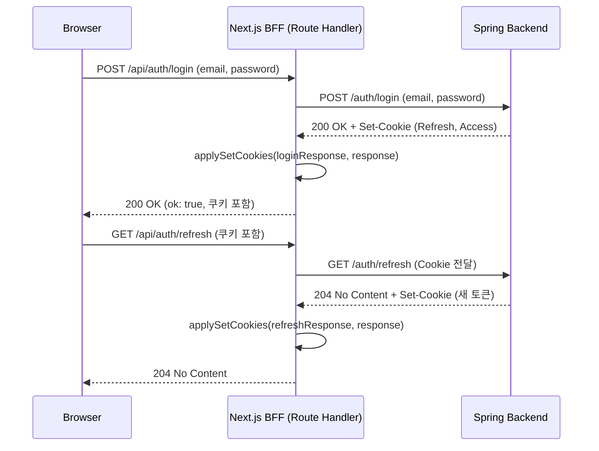

## 로그인 아키텍처 개선 (좌충우돌 기술부채 청산하기)
프로젝트를 진행하면서 가장 먼저 손봐야겠다고 느낀 부분이 바로 로그인 구조였다.

내가 합류했을 때부터 인증 방식은 로컬스토리지에 토큰을 저장하는 형태로 만들어져 있었다.
초기 개발 속도만 본다면 충분히 빠르게 구현할 수 있는 방식이고, 단순하게 로그인만 되는 수준에서는 문제가 없었을 것이다.

하지만 MVP 배포 시점이 다가오면서 이대로 배포하면 사고 난다는 느낌이 강하게 들었고 이런게 기술부채를 청산하는거구나 라고 느꼈다. (그러게 명세랑 설계좀 잘하지 ....)

## 로컬스토리지 기반 인증이 드러낸 문제들
가장 먼저 부딪힌 문제는 브라우저를 껐다 켜도 남아 있는 토큰이었다.

사용자가 로그아웃을 하지 않은 채 브라우저를 재실행하면 서버에서는 이미 토큰이 만료되었는데 클라이언트는 여전히 그 토큰을 들고 있어 재진입 시마다 401이 발생하는 상황이 반복됐다.

더 심각한 문제는 해결 방법이 `개발자 도구 열고 직접 로컬스토리지에서 토큰 지우기`였다는 점이다.
이건 정상적인 UX가 아니라 그냥 `삭제가 안 되는 로그인`이었고 그 상태로 MVP를 배포한다는 건 있을 수 없었다.

보안적인 측면에서도 문제가 많다고 생각했다. 로컬스토리지는 JavaScript로 접근 가능하기 때문에 XSS 취약점 하나만 있어도 토큰이 그대로 털릴 수 있었다. MVP라고 해서 보안을 포기할 수는 없고, 최소한의 방어선은 갖춰야 한다고 생각했는데 기존 구조는 사실상 방어선 자체가 없는 상태였다. (이를 방어하거나 대책을 세웠던 기록 또는 문서가 정의되어있지 않았다.)

## 쿠키 기반 JWT로 전면 전환하기까지
이 문제들이 한꺼번에 터지면서 인증 구조를 지금이라도 고쳐야 한다는 결론에 도달했다.

그래서 기존 로컬스토리지 방식을 버리고 HttpOnly 쿠키 기반 JWT 인증 구조로 아키텍처를 전면 교체했다. `Refresh`와 `Access`모두 `HttpOnly`로 설정해 달라고 요청했다. 이부분은 검색해보니 논쟁이 있는거같은데 모두 `HttpOnly`로 설정해 달라고 부탁한 이유는 그동안의 개발이 주먹구구식으로 이루어졌기때문에 혹시모를 일이라도 챙기기 위해서였다. 이를 통해 XSS 위험을 줄였고 Next.js 서버 레이어에서도 쿠키 기반 인증 정보를 안정적으로 읽어올 수 있게 됐다.

사실 처음에는 `왜 로컬스토리지에 넣어놨지?`라는 생각도 들었지만 지금 돌아보면 당시 빠르게 작업하려면 그렇게 할 수도 있었겠다 싶다. 다만 배포 직전에 보안 장치 없이 로컬스토리지 기반 인증을 그대로 들고 가는 것은 확실히 올바르지 않았다는 판단이 들었다.

중간에 합류한 입장에서 보면 왜 그동안 리팩토링 기간을 제대로 잡지 못했는지는 알 수 없지만 분명 아쉬운 부분이었다. 결국 배포 직전에야 누적된 문제들이 한꺼번에 드러나며 기술부채를 체감하게 되었다.

그래서 백엔드에게 Refresh / Access 둘 다 HttpOnly로 설정해달라고 요청했다. Next.js는 SSR도 지원하고 서버 컴포넌트에서도 인증 정보를 읽을 수 있으니 향후 구조 확장에도 더 유리하다고 판단했기 때문이다.

## Next.js를 진짜로 Next.js답게 (BFF 도입)
이 인증 구조 개편은 자연스럽게 BFF 도입으로 이어졌다.

팀에 합류하고 코드를 분석해보니 Next.js를 사실상 `리액트처럼`사용하고 있었다. 메타데이터는 정의되어있지않았고 페이지 레이어에서 `use client`선언이 남발했다. 이번 기회에 서버 기능을 제대로 활용해보기로 했다.

Next.js Route Handler를 기반으로 BFF를 구축했고 클라이언트가 직접 Spring API를 호출하는 흐름을 `브라우저 → Next.js(BFF) → Spring`이런 구조로 재정비했다.

### 로그인 BFF 시퀀스 다이어그램


이제 인증 관련 쿠키 설정, 토큰 재발급, 응답 정규화 등은 전부 Next.js 서버 단에서 처리할 수 있게 되었고 프론트는 UI와 상태 관리에만 집중할 수 있는 구조가 마련됐다.

처음에는 급하게 만들다 보니 fetch로 임시 구현했지만 이제 axios 기반 공통 HTTP 클라이언트로 리팩토링해 에러 핸들링, 인터셉터, 쿠키 전달 등을 체계화할 계획이다.

### 로그인 BFF Route Handler
아래는 임시로빠르게 구축한 BFF 로그인 라우트(fetch 기반)이며 이후 axios 기반 공통 클라이언트로 리팩토링 예정
```js
if (!serverEnv.backendApiUrl) throw new Error('BASE_URL is not defined');

export async function POST(request: NextRequest) {
  const body = await request.json();
  const loginResponse = await fetch(`${serverEnv.backendApiUrl}/auth/login`, {
    method: 'POST',
    headers: {
      'Content-Type': 'application/json',
    },
    body: JSON.stringify(body),
    cache: 'no-store',
  });
  
  const payload = await safeJson(loginResponse);
  if (!loginResponse.ok) {
    const message = extractErrorMessage(payload) ?? '로그인에 실패했습니다.';
    return NextResponse.json({ message }, { status: loginResponse.status });
  }
  
  const response = NextResponse.json({ ok: true }, { status: 200 });
  applySetCookies(loginResponse, response);
  return response;
}
```

## 폴더 아키텍처 재정비의 시작점
쿠키 기반 인증과 BFF 구조를 도입하면서 폴더 구조부터 서버/클라이언트 책임 분리까지 전반적인 아키텍처를 다시 뜯어보게 되는 계기가 됐다. 그동안 Next.js를 반만 쓰고 있었구나 하는 깨달음도 있었고 앞으로 어떤 기준으로 구조를 잡아야 할지 방향성이 잡히기도 했다.

## 기술부채를 청산하며 얻은 것들
이번 로그인 구조 개선은 단순히 저장 위치를 옮기는 수준의 작업이 아니었다.

MVP가 견딜 수 있을 정도의 보안성과 안정성을 확보하기 위한 근본적인 아키텍처 재설계 과정이었다.
기술부채를 청산하면서 가장 크게 느낀 것은 `초기 설계가 진짜 중요하다`는 점이었다. 빠르게 달려가다 보면 놓치는 부분들이 생기는데 그게 인증 같은 핵심 영역이라면 결국 큰 비용으로 되돌아온다.

하지만 이번 경험을 통해 Next.js의 서버 기능을 제대로 활용하는 법, JWT 기반 인증 구조의 설계 포인트, BFF 패턴의 장점 등을 확실하게 체득할 수 있었다.

완벽하다고 말할순 없지만 현재 로그인 구조는 이전보다 훨씬 견고해졌고 앞으로 RBAC, 보호 라우트 및 세션 기반 UX 최적화 등 더 많은 개선을 이어갈 수 있는 기반이 생겼다고 느낀다.

이번 개선은 단순한 리팩토링이 아니라, 결국 팀의 개발 문화와 아키텍처 방향성까지 다시 생각하게 해준 의미 있는 작업이었다.