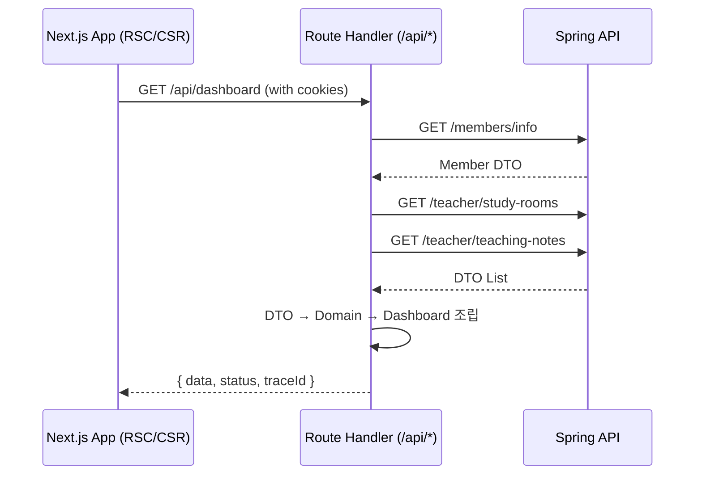
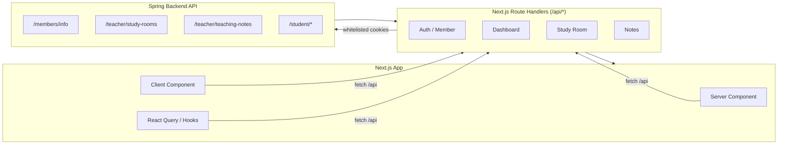

## Next.js BFF 도입 회고 (경계를 되찾는 과정)
프로젝트가 커지면서, 화면마다 Spring API를 직접 호출하는 방식이 한계에 부딪히기 시작했다.

페이지마다 `fetch → 응답 매핑 → 에러 처리`가 반복되고 SSR 페이지와 CSR 훅은 서로 다른 인증 흐름을 쓰고 있었다. 심지어 같은 `멤버 조회 API`를 호출하더라도 어떤 화면은 쿠키 기반, 어떤 화면은 헤더 기반으로 인증을 보내는 일도 벌어졌다.

스테이징/운영 환경이 섞이는 문제도 매번 반복됐다. `이 페이지는 운영 백엔드를 봐야 해요` 같은 요청이 계속 들어오고 QA 실패 로그를 디버깅하려면 `어떤 페이지가 어떤 헤더로 호출했는지`를 추적하는 데만 시간이 오래 걸렸다.

App Router로 넘어왔지만 `라우트 핸들러(/app/api)`는 사실상 빈껍데기였다. Next.js를 쓰고 있어도 구조는 거의 `React SPA + SSR 한 스푼`에 가까웠다. `Next.js를 쓰고도 SPA스럽게 굴고 있다`는 피로감이 누적되던 시점이었다.

결국 문제는 한 가지로 귀결되었다. 프런트가 너무 많은 걸 알고 있고, 너무 많은 걸 직접 하고 있었다. 그리고 그 경계를 되찾지 않는 한 계속해서 같은 문제를 반복하리라는 확신이 들었다.

<br/>

## 그래서 BFF를 도입하기로 했다
문제를 해결하기 위해 가장 먼저 손대고 싶었던 건 경계였다.
프런트와 백엔드가 뒤섞인 구조에서는 어느 쪽이 무엇을 책임져야 하는지조차 모호했고 결국 프런트가 과도하게 많은 것을 알고 있는 상황이 반복되고 있었다.
이 경계를 다시 세우지 않는다면 같은 문제를 계속 겪을 것이라는 확신이 들었다.

그 과정에서 자연스럽게 BFF가 답이라는 결론에 도달했다.  
복잡한 의사결정처럼 보였지만 사실 내가 BFF에 기대한 역할은 매우 명확했다.

### 1. 프런트의 호출 경계를 하나로 통일한다.
프런트는 /api/*만 호출하고 백엔드 주소나 인증 규칙 같은 상세한 구현은 BFF가 대신 책임진다.(캡슐화)

### 2. 인증 흐름을 모두 같은 레일 위에 올린다.
SSR과 CSR을 cookies() 기반으로 통일해 페이지마다 인증 방식이 달라지는 혼란을 근본적으로 없앤다.

### 3. 백엔드 DTO가 그대로 UI를 오염시키지 않도록 막는다.
BFF에서 DTO를 도메인 객체로 변환해 UI는 도메인 구조만 의존하도록 만들어 기능별 일관성을 확보한다.

### 4. 장애를 하나의 지점에서 추적할 수 있게 한다.
로깅, traceId, 타임아웃, 재시도를 BFF 중앙에서 처리해 문제가 발생했을 때 어디를 보아야 하는지가 분명해지도록 한다.

도입 동기는 단순했지만 구조를 갈아엎는 작업은 결코 작지 않았다.  
하지만 이 네 가지 원칙이 향후 작업 방향을 결정하는 확실한 기준점이 되어주었다.

<br/>

## Route Handler로 구현한 BFF 구조
BFF는 `app/api/v1(version)/[feature]/route.ts` 단위로 구성했다.  
각 route 파일 하나가 그 기능(feature)의 경계 역할을 한다.

대시보드 API는 그중에서도 구조가 가장 명확하게 드러나는 페이지였다.
이것 하나만 보면 `프런트에서 BFF를 왜 했는지`가 선명하게 보인다.

아래는 실제로 작성한 대시보드 BFF의 흐름이다.
1. 멤버 정보 조회 → DTO 파싱 
2. 멤버 role을 대시보드용 teacher/student로 변환 
3. 스터디룸, 노트 데이터를 병렬 조회 
4. role에 맞게 DTO → Domain 변환 
5. 마지막에 Dashboard 도메인으로 조립 후 UI에 반환

이 흐름은 실제 코드에서도 그대로 나타난다.
```js
const memberResponse = await api.bff.server.get<MemberDTO>('/members/info');
const memberEnvelope = member.dto.envelope.parse(memberResponse);
const memberDTO = memberEnvelope.data;

const dashboardRole = toDashboardRole(memberDTO.role);

// 병렬 조회
const endpoints = getEndpoints(dashboardRole);
const [roomsResponse, notesResponse] = await Promise.all([
  api.bff.server.get(endpoints.rooms, { params: { size: 3 } }),
  api.bff.server.get(endpoints.notes, { params: { size: 3 } }),
]);

// Notes: DTO → Domain
const notesEnvelope = note.adapters.listItem.parse(notesResponse);
const notesDomain = note.factory.fromList(notesEnvelope.data);

// Rooms: Teacher / Student 분기
if (dashboardRole === 'teacher') {
  const roomsEnvelope = room.adapters.teacher.list.parse(roomsResponse);
  const teacherRoomsDomain = room.factory.teacher.list(roomsEnvelope.data);

  return NextResponse.json(
    { data: dashboard.adapter.fromSources({
      role: 'teacher',
      member: memberDTO,
      rooms: teacherRoomsDomain,
      notes: notesDomain,
    }) },
    { status: 200 }
  );
}
```
이제 UI는 백엔드 스키마를 신경 쓸 필요가 없다.  
BFF가 DTO를 도메인 형태로 조립해 넘겨주기 때문에 프런트는 Dashboard 도메인 객체 하나만 받아서 렌더링하면 된다. 이 작은 변화가 전체 코드베이스의 복잡도를 눈에 띄게 낮춰 주었다.

<br/>

## 인증은 cookies() 기반으로 완전히 통일했다
예전에는 화면마다 인증 방식이 조금씩 달랐다.  
어떤 페이지는 Authorization 헤더를 보내고, 어떤 페이지는 Cookie를 사용하며 상황에 따라 sid/refresh가 어긋나는 일도 흔했다. 결국 `같은 사용자`여도 페이지에 따라 다른 인증 정보가 전달되는 일이 반복되었고 환경이 섞이는 문제의 원인도 대부분 여기서 비롯되었다.

BFF를 도입한 뒤에는 인증 흐름을 아예 cookies() 기반으로 단일화했다.
```js
const cookieJar = await cookies();
const token = cookieJar.get('Authorization') ?? cookieJar.get('sid');
if (!token) return new NextResponse(null, { status: 204 });

// 백엔드로 전달할 쿠키 whitelist
const allow = new Set(['Authorization', 'refresh']);
const cookieHeader = cookieJar
  .getAll()
  .filter((cookie) => allow.has(cookie.name))
  .map((cookie) => `${cookie.name}=${cookie.value}`)
  .join('; ');
```
이제 모든 인증은 cookies()에서 읽고 백엔드로 전달되는 값은 Authorization·refresh 두 개만 허용한다. credentials가 섞이거나 예상치 못한 쿠키가 전달되는 문제도 여기서 걸러낸다.

이 작은 통일이 생각보다 큰 효과를 가져왔다.  
QA 환경이 운영/스테이징으로 뒤섞이는 일이 사라졌고 “이 화면은 어떤 헤더로 API를 보낸 거지?”를 살펴보기 위해 로그를 뒤지던 시간도 자연스럽게 줄어들었다.  
인증 자체가 더 이상 변수가 아닌 예측 가능한 흐름이 된 셈이다.

<br/>

## BFF를 추가하고 난 뒤 달라진 것들
가장 크게 느낀 건 관찰성(Observability) 이었다.  
예전에는 UI 콘솔 로그만 보고 백엔드 팀에 문의해야 했는데 이제는 모든 요청이 `/api/*`를 지나면서 traceId가 남는다. 장애가 나도 원인을 찾는 데 걸리는 시간이 절반 이하로 줄었다.

또 하나는 도메인 일관성이다.  
백엔드가 스키마를 바꾸더라도 UI는 BFF에서 조립해주는 Domain 구조만 보면 된다.
덕분에 UI 코드가 훨씬 안정적으로 이어졌다.

물론 과정은 쉬운 편이 아니었다.  
환경 변수 하나 이름 바꾸는 작업이 `GitHub Actions`, `Docker Compose`, `Vercel 설정`까지 도미노처럼 이어졌다. `파이프라인 문서를 왜 미리 정리해두지 않았을까…`라는 후회도 남았다.

하지만 결과적으로 얻은 것은 명확했다.  
Next.js답게 개발하는 방식이 무엇인지 팀 전체가 한 번 더 생각해볼 기회가 되었다는 것.
그리고 프런트엔드가 `API를 호출하는 소비자`에서 `경계를 세우는 주체`로 역할을 되찾았다는 점이 개인적으로 가장 큰 의미라고 생각한다.

작은 라우트 핸들러 도입에서 출발했지만 팀의 개발 방식 전체를 한 단계 끌어올린 변화였다.

<br/>

## 전체 구조를 나타낸 다이어그램
### 시퀀스 흐름


### 전체 아키텍처


## 마무리하며
BFF를 도입한 경험은 단순히 `구조를 정리했다`는 정도에서 끝나지 않았다.  
Next.js가 가진 기능을 어떻게 써야 하는지에 대한 이해가 훨씬 깊어졌고 프런트가 백엔드와 맞붙어 싸우는 구조가 아니라 경계를 세우고 책임을 분리하는 구조로 진화할 수 있었다.

작은 라우트 핸들러 하나로 시작했지만 결과적으로 팀 전체의 개발 경험이 한 단계 올라갔다.
그리고 개인적으로는 `프런트엔드는 단순 UI가 아니다`라는 감각을 다시 확인한 작업이었다.