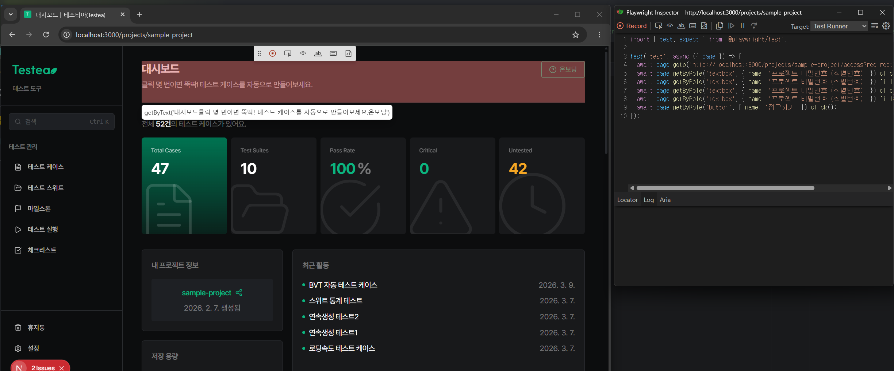

# Locator

[Locator](https://playwright.dev/docs/locators)는 페이지에서 **특정 시점에 요소를 찾는 방법**이다. 단순 셀렉터가 아니라 "이 요소를 어떻게 식별할지"에 대한 전략에 가깝다.

## 권장 우선순위

| 순위 | API | 언제 쓰나 |
| --- | --- | --- |
| 1 | `getByRole` | 거의 항상 1순위. 접근성 트리의 역할(role) + 이름(name)으로 식별 |
| 2 | `getByLabel` | `<label>`로 묶인 form 요소 (input/textarea/select) |
| 3 | `getByPlaceholder` | label이 없고 placeholder만 있는 input |
| 4 | `getByText` | 정적 텍스트 (버튼/링크 외의 본문성 요소) |
| 5 | `getByTitle` | `title` 속성으로 식별되는 요소 |
| 6 | `getByTestId` | 위 방법으로 잡기 어려운 경우의 마지막 보루 (`data-testid`) |
| 7 | `locator(css/xpath)` | 정말 어쩔 수 없을 때 |

사용자가 실제로 보고 인지하는 방식(역할/레이블/텍스트)에 가까울수록 위쪽, DOM 구조에 의존할수록 아래쪽이다. 위쪽 로케이터는 리팩터링·DOM 변경에 강하다.

## 우선순위 적용에 대한 오해

처음엔 "`getByRole`로 다 작성 → 깨지면 한 단계씩 내려가기" 식으로 접근했는데, **이건 안티패턴**이다.

- 매칭이 1개라도 잡히면 테스트가 "통과"해 버려, 잘못된 요소를 잡고 있어도 알아채지 못한다.
- 우선순위는 **요소마다 사전에 판단**하는 기준이다. 테스트를 돌려서 결정하는 게 아니다.
- 판단 기준: 해당 요소에 **역할(role)과 접근 가능한 이름(accessible name)이 제대로 부여돼 있는지**를 DOM/접근성 트리에서 미리 확인하고 결정한다.

즉 순서는 "실행 → 떨어지면 내려간다"가 아니라 "DOM 보고 → 이 요소엔 뭐가 가장 안정적인지 고른다"이다.

## 어떻게 찾나

DOM과 접근성 트리를 미리 보는 도구는 여러 가지가 있다.

- `npx playwright codegen <url>`
  페이지에서 클릭하면 권장 우선순위대로 로케이터를 자동 생성한다.
- `npx playwright test --ui` (UI 모드), Playwright Inspector, `page.pause()`
  "Pick locator"로 요소를 집어 보고 매칭 개수를 즉시 확인할 수 있다.
- VS Code Playwright 확장의 "Pick locator", 브라우저 DevTools 접근성 패널
- 컴포넌트 소스를 직접 읽고 role/label 확인

`npx playwright codegen <url>`을 실행하면 다음과 같이 출력된다.

## 참고

- [Playwright Locators 공식 문서](https://playwright.dev/docs/locators)
